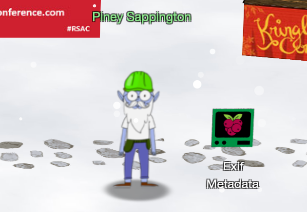

# Hints for Objective 2: Where in the World is Caramel Santaigo?

<br>[Go back](../Hints.md)

## Overview
Requested by Piney Sappington, found in KringleCon - Courtyard
<br>
**Task**: Exifdate  
**Description**: 

```
HELP! That wily Jack Frost modified one of our naughty/nice records, and right 
before Christmas! Can you help us figure out which one? We've installed exiftool
for your convenience!

Filename (including .docx extension) > 
```



## Resources
* Exiftool man page: http://manpages.org/exiftool

## Solution

One of the files seem to contain altered metadata. So let's loop over all files and compare the output of the exiftool helper:

``` bash
elf@e2533911c94b:~$ for i in *; do echo $i; exiftool $i | wc; done
..
2021-12-20.docx
     44     186    1928
2021-12-21.docx
     44     186    1927
2021-12-22.docx
     44     186    1928
```

So the 21-file seems to be the target:

``` bash
elf@e2533911c94b:~$ exiftool 2021-12-21.docx
..
Last Modified By       : Jack Frost
..
```

## Hints given

* **Coordinate Systems:** Don't forget coordinate systems other than lat/long like [MGRS](https://en.wikipedia.org/wiki/Military_Grid_Reference_System) and [what3words](https://what3words.com/).
* **Flask Cookies:** While Flask cookies can't generally be forged without the secret, they can often be [decoded and read](https://gist.github.com/chriselgee/b9f1861dd9b99a8c1ed30066b25ff80b).
* **OSINT Talk:** Clay Moody is giving [a talk](https://www.youtube.com/watch?v=tAot_mcBT9c) about OSINT techniques right now!

<br>[Go back](../Hints.md)
