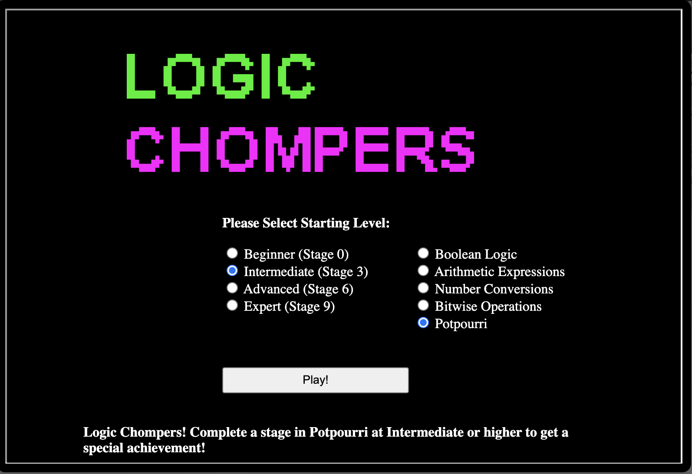

# Hints for Objective 4: Slot Machine Investiation

<br>[Go back](../Hints.md)

## Overview
Requested by Noel Boetie, found in The North Pole - The North Pole
<br>
**Task**: Logic Munchers     
**Description**: 

```
Logic Chompers! Complete a stage in Potpourri at Intermediate or higher to get a special achievement!

Controls:

Arrow keys or WASD: Move Chompy
Enter or Space: Chomp the current expression
Click: Navigate to adjacent squares and chomp the square Chompy's in
Esc: Pause the game
i: Toggle text and iconography
```




## Resources
* Boolean logic: https://eng.libretexts.org/Bookshelves/Computer_Science/Programming_Languages/Introduction_To_MIPS_Assembly_Language_Programming_(Kann)/01%3A_Introduction/1.07%3A_Boolean_Logical_and_Bitwise_Operators

## Solution

Well, there is no real hint here than just to follow the rules, solve the equations and watch for the trolls ;)  
Stay away from the edges as well ;)

## Hints given

* **Parameter Tampering:** It seems they're susceptible to [parameter tampering](https://owasp.org/www-community/attacks/Web_Parameter_Tampering).
* **Intercepting Proxies:** Web application testers can use tools like [Burp Suite](https://portswigger.net/burp/communitydownload) or even right in the browser with Firefox's [Edit and Resend](https://itectec.com/superuser/how-to-edit-parameters-sent-through-a-form-on-the-firebug-console/) feature.

<br>[Go back](../Hints.md)
