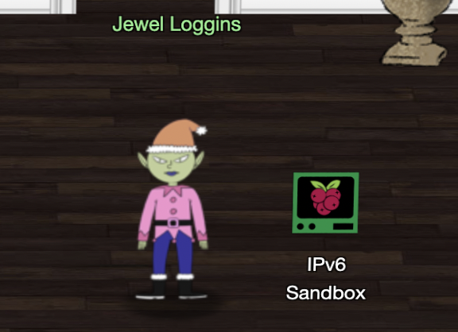

# Hints for Objective 5: Strange USB Device

<br>[Go back](../Hints.md)

## Overview
Requested by Jewel Loggins, found in KringleCon - Talks Lobby
<br>
**Task**: IPv6 Sandbox.   
**Description**: 

```
Tools:

* netcat
* nmap
* ping / ping6
* curl

Welcome, Kringlecon attendee! The candy striper is running as a service on                    
this terminal, but I can't remember the password. Like a sticky note under the                
keyboard, I put the password on another machine in this network. Problem is: I                
don't have the IP address of that other host.

Please do what you can to help me out. Find the other machine, retrieve the                   
password, and enter it into the Candy Striper in the pane above. I know you                   
can get it running again!
```



## Resources
* Nmap IPv6 usage: https://nmap.org/book/port-scanning-ipv6.html
* Curl man page: https://curl.se/docs/manpage.html
* How to ping a subnet in IPv6: https://superuser.com/questions/495026/ipv6-find-all-hosts-in-a-prefix

## Solution

Let’s ping for further IPv6 hosts

``` bash
ping6 -I 2604:6000:1528:cd:d55a:f8a7:d30a:3 ff02::1%eth0
```

We have a few candidates

``` 
2604:6000:1528:cd:d55a:f8a7:d30a:1
2604:6000:1528:cd:d55a:f8a7:d30a:2
2604:6000:1528:cd:d55a:f8a7:d30a:3
2604:6000:1528:cd:d55a:f8a7:d30a:e405
```

Let’s see what’s running on that last machine

``` bash
nmap -6 2604:6000:1528:cd:d55a:f8a7:d30a:e405
```

Port 80 and 9000 open so we use curl and Netcat to inspect them

``` bash
curl -6 -g 'http://[2604:6000:1528:cd:d55a:f8a7:d30a:e405]:80/'
netcat -6 '2604:6000:1528:cd:d55a:f8a7:d30a:e405' 9000
```

The second port gives us the passphrase

*PieceOnEarth*

## Hints given

* **Ducky Script:** [Ducky Script](https://docs.hak5.org/hc/en-us/articles/360010555153-Ducky-Script-the-USB-Rubber-Ducky-language) is the language for the USB Rubber Ducky
* **Duck Encoder:** Attackers can encode Ducky Script using a [duck encoder](https://docs.hak5.org/hc/en-us/articles/360010471234-Writing-your-first-USB-Rubber-Ducky-Payload) for delivery as inject.bin.
* **Mitre ATT&CK™ and Ducky:** The [MITRE ATT&CK™ tactic T1098.004](https://attack.mitre.org/techniques/T1098/004/) describes SSH persistence techniques through authorized keys files.
* **Ducky RE with Mallard:** It's also possible the reverse engineer encoded Ducky Script using [Mallard](https://github.com/dagonis/Mallard).

<br>[Go back](../Hints.md)
