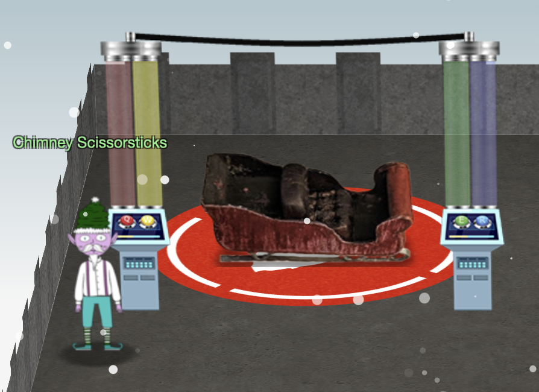

# Hints for Objective 6: Shellcode Primer

<br>[Go back](../Hints.md)

## Overview
Requested by Chimney Scissorsticks, found in KringleCon - NetWars
<br>
**Task**: Holiday Hero.     
**Description**: 

```
Santa's HOLIDAY HERO

1. RANDOM MATCH MAKING
2. CREATE ROOM
3. JOIN ROOM
```

In this browser based game you have to collect fuel and reach a certain percentage so Santa's sleigh can depart. It was made for two player where one player creates a room and a second player can join that room by using the same room ID.  
Each player needs to press one of two keys at the correct time so the fuel gets collected.  



## Resources
*None*

## Solution

While this game could be modified (by tweaking cookies) to support a single player mode I have chosen the "think-outside-the-box" strategy: Put two laptops next to each other, created a room and the invitation at the same time and played the game having one hand on each laptop's keyboard. :smile:

## Hints given

* **Debugging Shellcode:** Also, troubleshooting shellcode can be difficult. Use the debugger step-by-step feature to watch values.
* **Register Stomping:** Lastly, be careful not to overwrite any register values you need to reference later on in your shellcode.
* **Shellcode Primer Primer:** If you run into any shellcode primers at the North Pole, be sure to read the directions and the comments in the shellcode source! 

<br>[Go back](../Hints.md)
