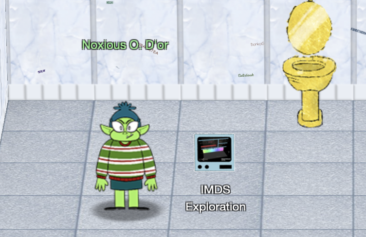

# Hints for Objective 10: Now Hiring!

<br>[Go back](../Hints.md)

## Overview
Requested by Noxious O D'or, found in FrostFest - Jack’s Restroom
<br>
**Task**: IMDS Exploration     
**Description**: 

```
🎄🎄🎄 Prof. Petabyte here. In this lesson you'll continue to build your cloud asset skills,
🎄🎄🎄 interacting with the Instance Metadata Service (IMDS) using curl.
🎄🎄🎄
🎄🎄🎄 If you get stuck, run 'hint' for assitance.
🎄🎄🎄

The Instance Metadata Service (IMDS) is a virtual server for cloud assets at the IP address
169.254.169.254. Send a couple ping packets to the server.
```



## Resources
* None

## Solution

First we ping the IMDS

``` bash
ping 169.254.169.254
```

And we follow the hint system (The commands you'll need to enter are shown by the hint system)

``` bash
curl http://169.254.169.254
curl http://169.254.169.254/latest
curl http://169.254.169.254/latest/dynamic
curl http://169.254.169.254/latest/dynamic/instance-identity/document
curl http://169.254.169.254/latest/dynamic/instance-identity/document | jq
curl http://169.254.169.254/latest/meta-data
curl http://169.254.169.254/latest/meta-data/hostname
curl http://169.254.169.254/latest/meta-data/hostname ; echo
curl http://169.254.169.254/latest/meta-data/iam/security-credentials
curl http://169.254.169.254/latest/meta-data/iam/security-credentials/elfu-deploy-role
```

Let’s switch over to IMDSv2 which uses token for authentication

``` bash
elfu@0c4829dafe5e:~$ cat gettoken.sh 
TOKEN=`curl -X PUT "http://169.254.169.254/latest/api/token" -H "X-aws-ec2-metadata-token-ttl-seconds: 21600"`
source gettoken.sh
echo $TOKEN
curl -H "X-aws-ec2-metadata-token: $TOKEN" http://169.254.169.254/latest/meta-data/placement/region
```

## Hints given

* **AWS IMDS Documentation:** The [AWS documentation for IMDS](https://docs.aws.amazon.com/AWSEC2/latest/UserGuide/instancedata-data-retrieval.html) is interesting reading.

<br>[Go back](../Hints.md)
