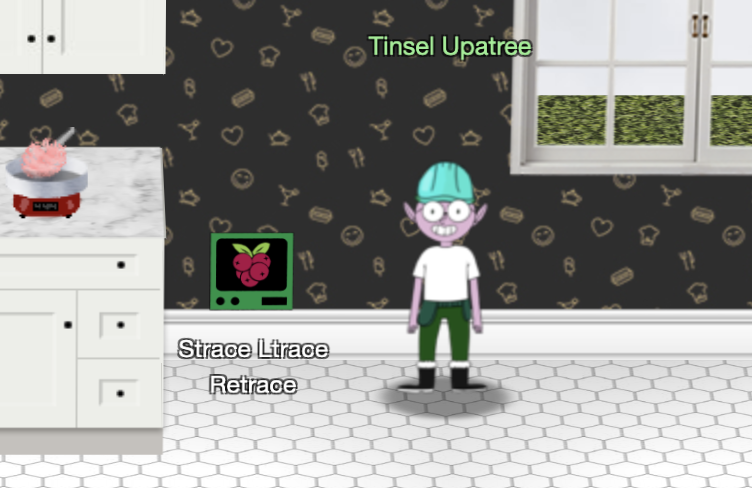

# Hints for Objective 11: Customer Complaint Analysis

<br>[Go back](../Hints.md)

## Overview
Requested by Tinsel Upatree, found in KringleCon - Kitchen
<br>
**Task**: Strace Ltrace Retrace   
**Description**: 

```
================================================================================

Please, we need your help! The cotton candy machine is broken!

We replaced the SD card in the Cranberry Pi that controls it and reinstalled the
software. Now it's complaining that it can't find a registration file!

Perhaps you could figure out what the cotton candy software is looking for...

================================================================================
```



## Resources
* ltrace man page: https://man7.org/linux/man-pages/man1/ltrace.1.html
* strace man page: https://man7.org/linux/man-pages/man1/strace.1.html

## Solution

The binary is missing some configuration file:

``` bash
kotton_kandy_co@d1c631b1cf57:~$ ./make_the_candy 
Unable to open configuration file.
```

Let’s strace that file to see if we can find some missing dependency:

``` bash
kotton_kandy_co@d1c631b1cf57:~$ strace ./make_the_candy
..
openat(AT_FDCWD, "registration.json", O_RDONLY) = -1 ENOENT (No such file or directory)
..
```

Let's create that file with some dummy content and run the binary again:

``` bash
kotton_kandy_co@d1c631b1cf57:~$ touch registration.json
ton_kandy_co@d1c631b1cf57:~$ echo something >> registration.jso
kotton_kandy_co@d1c631b1cf57:~$ ./make_the_candy 
Unregistered - Exiting.
```

Seems the binary expects that file to contain certain information, let’s ltrace that file (maybe we can found some function calls regarding the content):

``` bash
kotton_kandy_co@d1c631b1cf57:~$ ltrace -S -f ./make_the_candy
..
[pid 26] strstr("something\n", "Registration")            = nil
..
```

This way we can see the strings that are expected and we can rebuild the full configuration file:

``` bash
kotton_kandy_co@d1c631b1cf57:~$ vim registration.json 
kotton_kandy_co@d1c631b1cf57:~$ cat registration.json 
Registration: True
kotton_kandy_co@d1c631b1cf57:~$ ./make_the_candy 

Launching...
```

## Hints given

* **Wireshark Display Filters:** Different from BPF capture filters, Wireshark's [display filters](https://wiki.wireshark.org/DisplayFilters) can find text with the contains keyword - and evil bits with ip.flags.rb.
* **Evil Bit RFC:** [RFC3514](https://datatracker.ietf.org/doc/html/rfc3514) defines the usage of the "Evil Bit" in IPv4 headers.

<br>[Go back](../Hints.md)
