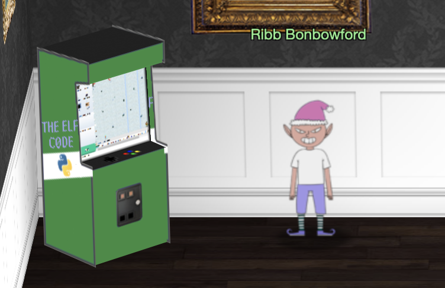
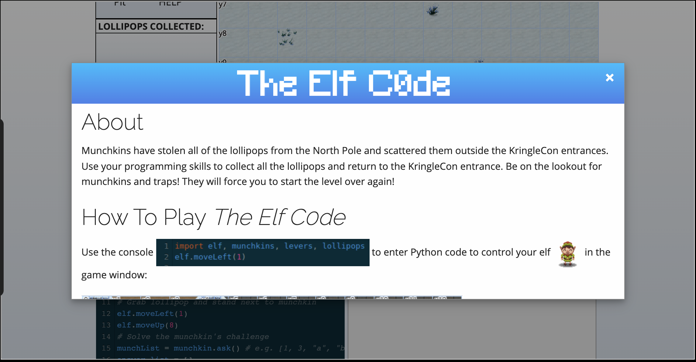

# Hints for Objective 12: Frost Tower Website Checkup

<br>[Go back](../Hints.md)

## Overview
Requested by Ribb Bonbowford, found in KringleCon - Dining Room
<br>
**Task**: The Elf Code   
**Description**: 

```
Welcome to

Python Edition!
Mischevious munchkins have nabbed all the North Pole's lollipops intended for good children all over the world.

Use your Python skills to retrieve the nabbed lollipops from at least eight entrances to KringleCon.

Click to begin or continue at your current task.

Inspired by SANS SEC573 pyWars.

Not Familiar with Python?
Take a look at The Ultimate Python Beginner's Handbook or the CodeAcademy interactive Python tutorial.
```





## Resources
* The Ultimate Python Beginner's Handbook: https://www.freecodecamp.org/news/the-python-guide-for-beginners/
* CodeAcademy interactive Python tutorial: https://www.codecademy.com/courses/learn-python-3/lessons/python-hello-world/exercises/welcome

## Solution

In this simulator you need to write Python code which interacts with the objects. You also need to fulfill certain requirements to finish a level successfully.  
Each level can have different solutions, but each level has a very good description and hints so you can always start with a template and finish the missing parts.  
<br>
The programs are:

``` python
# First level
lollipop = lollipops.get(0)
elf.moveTo(lollipop.position)
elf.moveTo({"x":2,"y":2})
```

``` python
# Second level
lollipop1 = lollipops.get(1)
elf.moveTo(lollipop1.position)
lollipop0 = lollipops.get(0)
elf.moveTo(lollipop0.position)
elf.moveTo({"x":2,"y":2})
```

``` python
# Third level
lever0 = levers.get(0)
lollipop0 = lollipops.get(0)
elf.moveTo({"x":6,"y":12})
sum = lever0.data() + 2
lever0.pull(sum)
elf.moveTo(lollipop0.position)
elf.moveTo({"x":2,"y":2})
```

``` python
# Fourth level
lever0, lever1, lever2, lever3, lever4 = levers.get()
elf.moveLeft(2)
lever4.pull("A String")
elf.moveUp(2)
lever3.pull(1==1)
elf.moveUp(2)
lever2.pull(1)
elf.moveUp(2)
lever1.pull([1,2,3])
elf.moveUp(2)
lever0.pull({1:1,2:2})
elf.moveUp(2)
```

``` python
# Fifth level
lever0, lever1, lever2, lever3, lever4 = levers.get()
elf.moveLeft(2)
lever4.pull(lever4.data() + " concatenate")
elf.moveUp(2)
lever3.pull(not(lever3.data()))
elf.moveUp(2)
lever2.pull(1 + lever2.data())
elf.moveUp(2)
newlist=lever1.data()
newlist.append(1)
lever1.pull(newlist)
elf.moveUp(2)
newdict=lever0.data()
newdict["strkey"] = "strvalue"
lever0.pull(newdict)
elf.moveUp(2)
```

``` python
# Sixth level
lever = levers.get(0)
data = lever.data()
elf.moveTo(lever.position)
if type(data) == bool:
    data = not data
elif type(data) == int:
    data = data * 2 
elif type(data) == str:
    data = data + data
elif type(data) == list:
    data = [x+1 for x in data]
lever.pull(data)
elf.moveUp(2)
```

```python
# Seventh level
for num in range(2): 
    elf.moveLeft(3)
    elf.moveUp(15)
    elf.moveLeft(3)
    elf.moveDown(15)
elf.moveLeft(3)
elf.moveTo({"x":2,"y":2})
```

``` python
# Eighth level
all_lollipops = lollipops.get()
lever = levers.get(0)
for lollipop in all_lollipops:
    elf.moveTo(lollipop.position)
elf.moveTo(lever.position)
myarray = lever.data()
myarray.insert(0, "munchkins rule")
lever.pull(myarray)
elf.moveTo({"x":2,"y":6})
elf.moveTo({"x":2,"y":2})
```

## Hints given

* **SQL Injection with Source:** When you have the source code, API documentation becomes [tremendously](https://www.npmjs.com/package/express-session) [valuable](https://github.com/mysqljs/mysql).

<br>[Go back](../Hints.md)
