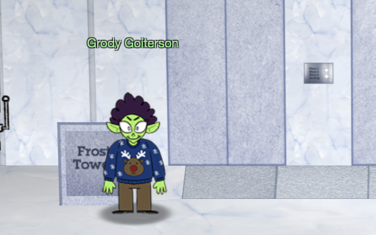
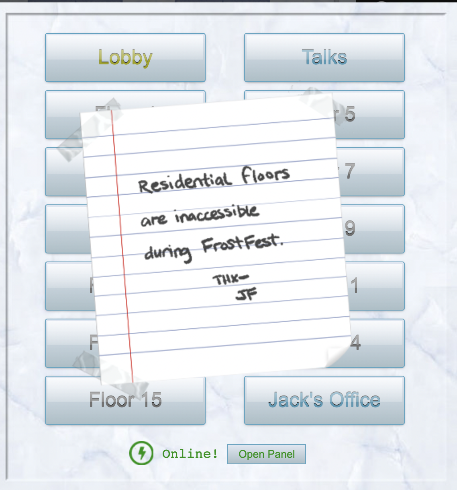
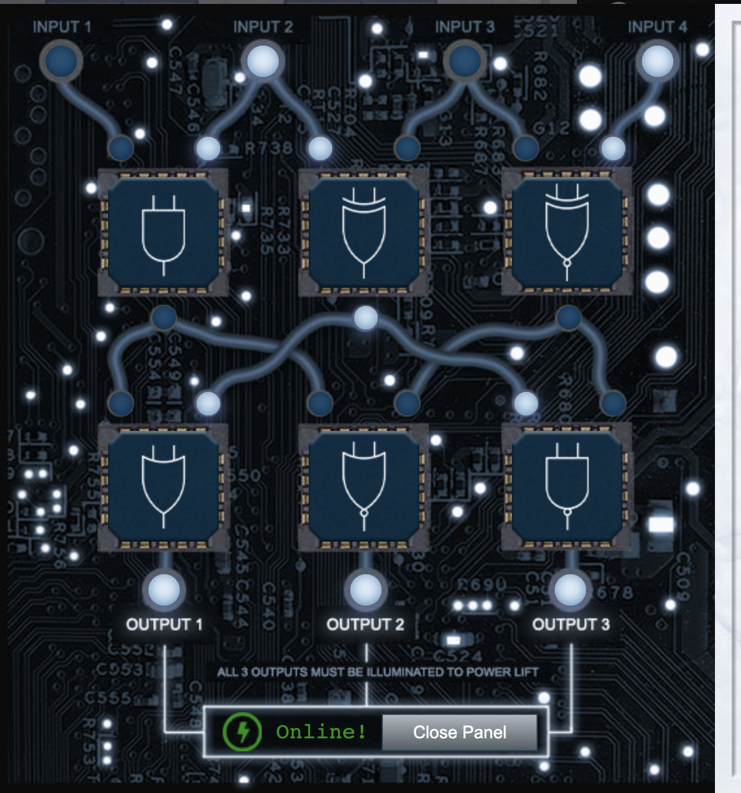

# Hints for Objective 13: FPGA Programming

<br>[Go back](../Hints.md)

## Overview
Requested by Grody Goiterson, found in FrostFest - Frost Tower Lobby
<br>
**Task**: Elevator quest  
**Description**: 

```
The elevator is offline, you need to configure the panel and arrange the circuit components so all output ports have power
```





## Resources
* Logic Gates and Circuits: https://logic.ly/lessons/

## Solution

You can use the resource link to see what effect each component has. The final solution looks like:  



## Hints given

* **FPGA Talk:** Prof. Qwerty Petabyte is giving [a lesson] about Field Programmable Gate Arrays (FPGAs).
* **FPGA for Fun:** There are [FPGA enthusiast](https://www.fpga4fun.com/MusicBox.html) sites.

<br>[Go back](../Hints.md)
