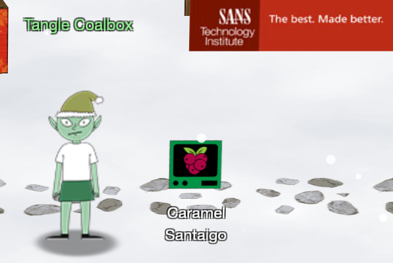
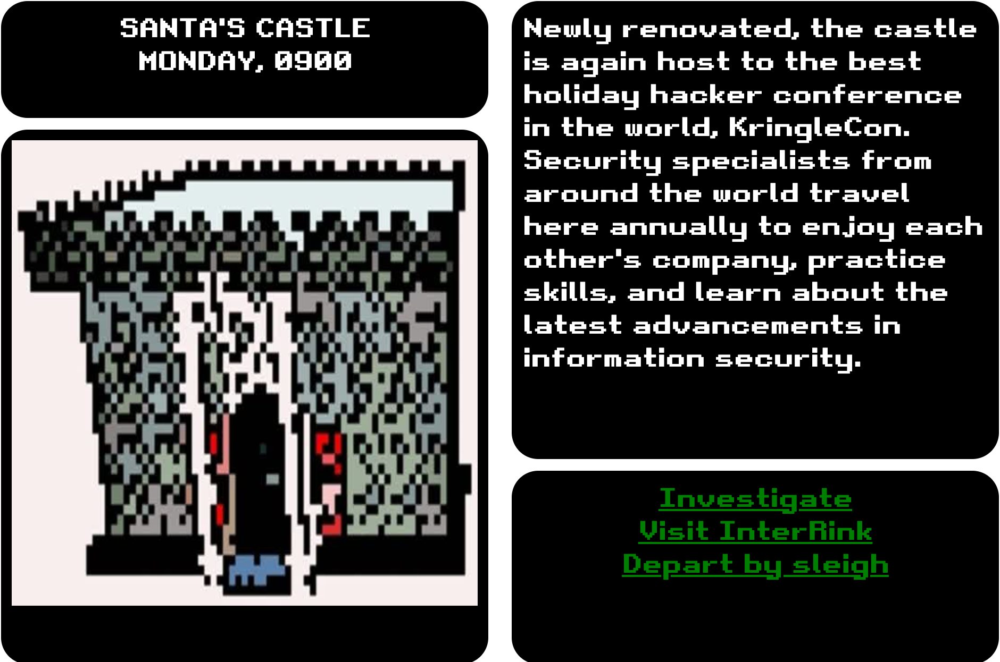

# Objective 2: Where in the World is Caramel Santaigo? 

<br>[Go back](Objectives.md)

## Overview
Requested by Tangle Coalbox, found in KringleCon - Courtyard  
<br>
**Difficulty**: :christmas_tree: (1/5)  
**Task**: Help Tangle Coalbox find a wayward elf in Santa's courtyard. Talk to Piney Sappington nearby for hints.  



## Resources
* Talk video "Using Open-Source Tools to Track Elves" by Clay Moody on Track 6
* [Hints from Piney Sappington](../hnt/Hint02.md), found in KringleCon - Courtyard

## Solution

Note: Each time you play the game you will get different questions and hints but missing one (and noting the answers) may help in another play.  
<br>
Playing the game always includes these steps:
* Investigate the current location (three points of interest)
* Note anything that might help you identify the target elf (e.g. "Oh, I noticed they had a **Firefly themed** phone case")
* Note anything that might help you identify the next stop (e.g. "their phone was going to work on the **1500 MHz LTE** band")
* Departy by sleigh to visit the next stop and use the InterRink terminal to filter possible target elves using your findings
You will most likel visit three stops, the investigations should give you enough information to filter the InterRink so only one target elf is left.  



Sample play log:

```
First stop: SANTA'S CASTLE
I think they left to check out the Défilé de Noël.
They called me and mentioned they were connected via Rogers Wireless.
They were dressed for -0.9°C and clear conditions. The elf got really heated about using tabs for indents.

Next stop must be MONTRÉAL, CANADA (contains the Défilé de Noël festival)
They were excited about checking out the Vánoční trhy.
They said something about NATO and 33U VR 58560 48464. /shrug
They were dressed for 5.0°C and partly cloudy conditions. Oh, I noticed they had a Firefly themed phone case.

Next stop must be PRAGUE, CZECH REPUBLIC (contains the Vánoční trhy market)
They said, if asked, they would describe their next location as "only milder vanilla."
They were excited that their phone was going to work on the 1500 MHz LTE band
They were dressed for 14.0°C and partly cloudy conditions. The elf mentioned something about Stack Overflow and Python.

Possible elves (checking the hints in the elf system):
Fitzy Shortstack

Next stop must be TOKYO, JAPAN (has the 1500 MHz LTE Japanese Band)

You just caught the elf!
You've won!
```

<br>[Go back](Objectives.md)
